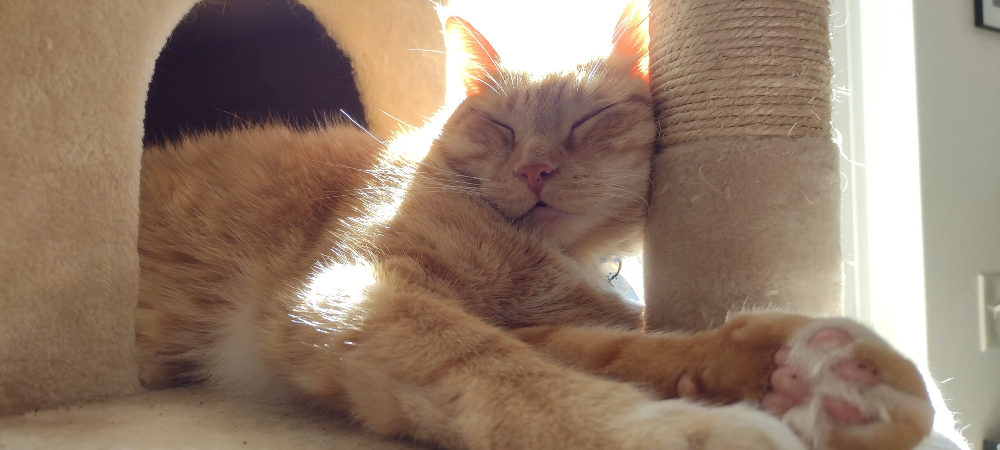

---
eleventyNavigation:
    key: About
    order: 3
---
# About

Hi! I don’t know how you found me, but welcome all the same!

This place is an evolving location for me online. As someone whose foothold with the internet dates back most predominately to the times of LiveJournal and the early days of Facebook, I feel all kinds of ways about what to do here. Is it going to become a strange clone of the LJ I used to maintain? Will it just be random photos I occasionally like to post? Will I start trying to share my knitting projects here? That all remains to be seen. Mostly, this is a location I’m trying to maintain for me, without the interference of someone else’s policy or UI changes constantly throwing things into disarray. Plus, I like to write, and maybe if I have this location I can start trying to more consistently put together strings of characters longer than the 280 to 400 count limit around the internet.

My interests include knitting, video games, literature, music, and cats. The photo above is our newest addition, Rudy. But our other resident cat Kochanski will likely appear often as well. I’m newly married to my most excellent, wonderful wife, Ivory. We reside in northern MN, where we tolerate winter and try to make the most out of the summer from our second-floor apartment.

In the age of Twitter’s crumbling, I definitely tried to stake my claim on pretty much every alternative to have arisen, and it seems like Bluesky might be the chosen successor of that brand of social media. At this point, any Meta-based social media gives me the yuck, so there's no more Instagram or Facebook for me. For it being a world-wide web, it's a pretty small place these days.

[Bluesky: **@peridotlines.com**](https://bsky.app/profile/peridotlines.com)
