_03/03/2004 - 05/20/2022_

I've had something of a tradition of writing to get through grief. It's been a while since I last did it, literally 2006, so, 16 years I guess? The last time, it was in the midst of an ending and saying goodbye to someone. This time, it's after the fact, and the grief feels partly raw and unmanageable, and somehow old and ingrained within me in a way I won't ever shake.

<figure>

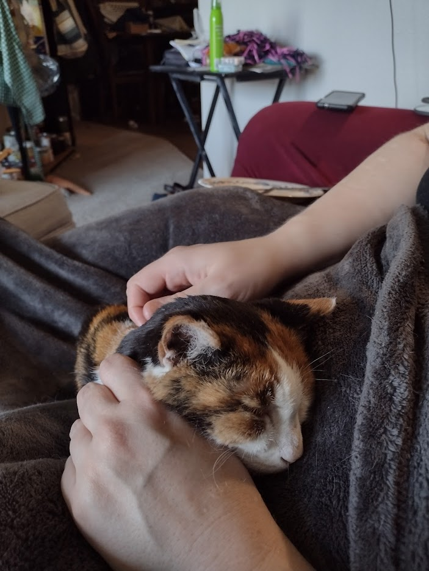

<figcaption>

Last pets with Moxie

</figcaption>

</figure>

<!--more Rest well, my beloved friend-->

A week ago, Monday morning, my partner Ivory made the call to set up a vet appointment, because Moxie had been battling something respiratory for a little while. For the 14 years I had her, runny eyes and noses were not something we encountered much, until the last year or so.

That afternoon, she went in for a few tests, an x-ray, and they found something indecipherable but ultimately painful and fatal. After a lot of tears and heartache, we decided it was for the best to avoid or prolong any suffering, and agreed we would bring her back to the vet on Friday and say our goodbyes.

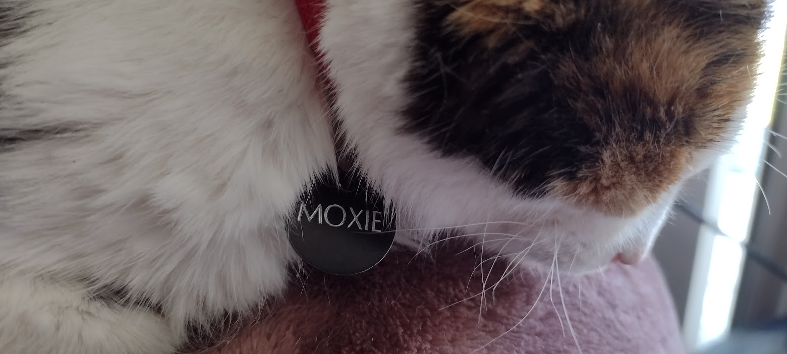

I wanted to share a little bit about her life, because when it's all said and done, I don't think it was a boring one.

According to her paperwork, Moxie was born on March 3, 2004. I adopted her on December 7, 2007. We met a few days before then, after my adoption application had been approved with [Pet Haven](https://pethavenmn.org/), and I had an opportunity to email with her foster mom. I went to 2 different foster homes on the same night to meet cats, one little black kitten named Luther, and Moxie, at the time named Heidi.

I remember driving home from meeting the kitten and being torn, because, who doesn't love a kitten? But I kept thinking about Moxie. Her situation wasn't exactly dire, but, she wasn't friends with the resident cat in her foster home, so she was mostly contained to a bathroom. She had been re-homed a couple of times, first when she and a sibling lost their elderly owner, and then when a resident cat at their new home didn't adapt well to their arrival. Her foster mom said she was an excellent lap cat, and "just an overall sweetheart." She had been very receptive to pets in the brief time we spent together, and I'm pretty sure I was hooked before I really knew it.

When I came to pick her up, I remember her foster mom saying how sad her kids were to see her go, but how happy they were for her to have a home. I took Moxie in the carrier, and as we approached my car she let out this sad, little, meow. I was worried she would find the drive home stressful, but it was the only peep I heard out of her for a little while.

<figure>

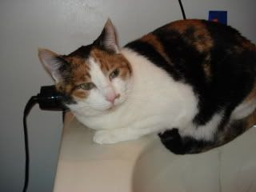

<figcaption>

Moxie, her first night home

</figcaption>

</figure>

Looking back, I'm not sure I had any business being a cat owner. Cats maintain a lot of boundaries, and opinions about who is and isn't allowed to cross them, and I've always just wanted to _pet the soft thing_. But, Moxie was kind of the perfect cat in that regard. After a relatively short adjustment period, she was a forever lap cat, who tolerated all manner of pets and cuddles, and she found the gentlest, most patient ways of enforcing her boundaries, to the point that I'd like to think she made me a better cat parent, even if the urge to _pet the soft thing_ can still overwhelm me at times.

<figure>

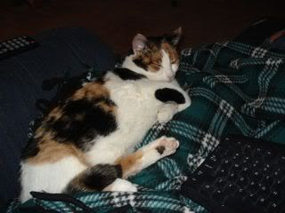

<figcaption>

Evening December 9, 2007 Cuddlebuddy for life.

</figcaption>

</figure>

<figure>

[Moxie and her wand toy](https://youtu.be/juQYVmxeQSI)

<figcaption>

I know its very dark to see anything here, but she LOVED this wand toy with a murderous affection.

</figcaption>

</figure>

<figure>

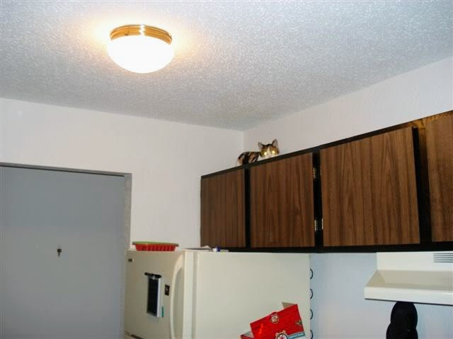

<figcaption>

My glowing eyes mean you can't see me up here

</figcaption>

</figure>

<figure>

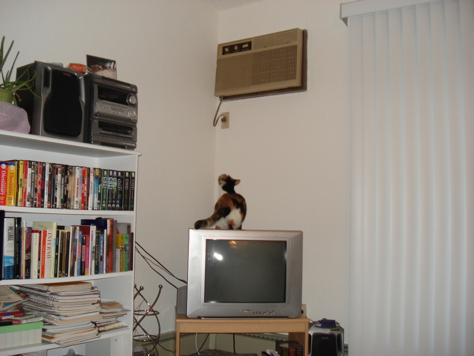

<figcaption>

The top of the TV, access to a whole new world

</figcaption>

</figure>

<figure>

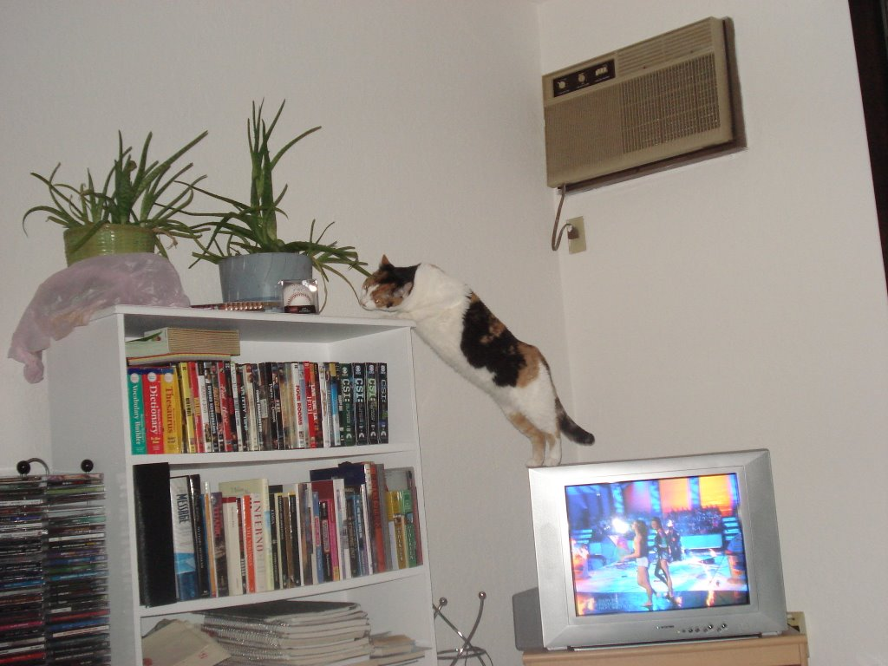

<figcaption>

Is this something I can eat?

</figcaption>

</figure>

We lived for 2 years in that apartment. We made a couple of trips north to visit family, once managing to go in the ditch on our way home. She was always a pretty happy traveler, never complaining or causing much of a fuss. But then, life happened and I ended up moving out of the cities and back to northern Minnesota.

I was adamant I would not be re-homing _my cat_, which proved to be a challenge since my family's cat, Sylvia, was very unreceptive to feline companionship. We went through a difficult adjustment period, where Moxie stayed at my parents lake cabin, by herself, with me going out once a day to see her and make sure she was okay.

That came to an end, when we found out she was going on some very dangerous escapades in the basement. On a Sunday afternoon, my mom and I took some DVDs out there with the plan to sit and watch movies for a while so Moxie could have some extended time with people. Except, Moxie was nowhere to be found. Thinking she'd gotten anxious after so much time alone, we decided to put on one of the DVDs and let her come out on her own.

Midway through the opening scenes, we could hear this sort of scratching sound coming from the wall behind the TV. So, we paused the movie and listened, and then I bolted down to the basement, hoping to catch sight of her; only to see nothing.

We restarted the movie, and a little bit later, there was the scratching again. Back downstairs, and horror awaited me. (what can I say, this cat made me pretty melodramatic)

The basement had access to a crawlspace, basically a wooden frame, with some kind of wood panel that fit in there with a couple of tabs to hold it in place. This was set in a wall made of cinder blocks.

Sticking out of the top of the wall was the very tip of Moxie's tail. She had climbed down one of those cinder-block tunnels, and was very much stuck there. Cue me panicking, my mom at a loss, and Moxie very much upset at us poorly attempting every manner of extraction without success.

At one point, I removed the cover to the crawlspace, and I remember looking up at her through the tiniest hole in the frame, only to discover the collar I'd noticed missing from her on my visit a couple of days prior, which meant she'd been down there before, and somehow managed to work her way out. (Ivory's conclusion, is that she was probably chasing a rodent of some kind, and it went down that tunnel into the crawlspace, so Moxie decided to follow it. Somehow, that had never occurred to me in all of the times I've recounted this story!)

There were no good angles to climb up a ladder so I could reach down to get hold of her, and she was stuck in a way that made it seem like even if we could yank her out, she might end up more hurt than helped. So, we had to wait until there were more scratching sounds, and she had managed to inch her way further up the inside of the wall. When she'd gotten further up, I had to grab hold of her tail, and pull her the rest of the way. I'm convinced her rather arthritic back in her later days can be traced to this incident.

After that, she spent the rest of the day on my lap, and was then locked in the bathroom until I could negotiate her release to the house.

<figure>

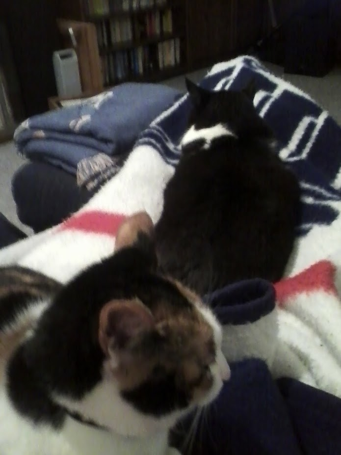

<figcaption>

Sylvia (tuxedo) and Moxie, unwilling cohabitants of a lap

</figcaption>

</figure>

Moxie seemed glad to have a sibling, but her excitement wasn't ever really reciprocated. There were quite a few angry chases around the house, and a lot of battling over food dishes, with me forcing my parents to "upgrade" their cat food because of both cats insistence upon stealing food from each other.

[Moxie and Sylvia's wild kingdom encounter](https://youtu.be/Q-RapG8Vt7U)

Things sort of settled into a routine. I got a new job, commuted to work, and we stayed with my parents for almost 4 years. In that time, the screaming chases came to an end, and Sylvia spent the summers out at the cabin with my parents, while Moxie and I stayed at the house.

One of Moxie's favorite pastimes there involved the basement. She managed to parkour her way across our laundry room using a water heater, the clothesline, and the side of the laundry chute, until she could find a way into the drop ceiling over our den. This meant you would be watching TV and you'd hear this sort of scuffling sound above you as she squeezed her way between the ceiling tiles and the floor joists. She would do this until she reached the far corner of the basement, although I could never figure out what the allure was. Maybe it was really warm over the TV?

Moxie also used to scale our big-screen TV until I got wise to why she felt comfortable jumping up there, and put a stop to it. It would have been one thing if that was it, but she used the TV as a platform to get to the top of our bookshelves, where she then walked to the corner and either fell down to the floor, or jumped there, with no way out. I spent a night in tears, convinced I was never going to see her again, before my mom realized she wasn't trapped in _another_ basement wall, just stuck in the tunnel between two bookshelves.

The last exciting thing to happen at the house, was when Moxie came into my bedroom with what I thought was a toy, just after I had gone to bed. It was making a noise I didn't recognize, and I had to turn on the light, just to see what it was. The loud, chirping toy, turned out to be a very perturbed bat, which she released just inside the door, allowing it to make a quick dive for a hiding spot, leaving just enough room for me to get out the door, with the cat, abandoning my bedroom entirely.

The next morning, I had to go on a search for the bat, and then my dad and I managed to get it out of the house without anyone getting hurt. I wish I could say that was Moxie's last encounter with bats, but that wasn't the case.

Fall of 2014 we finally moved out on our own again. And then Moxie learned to love living with radiators.

<figure>

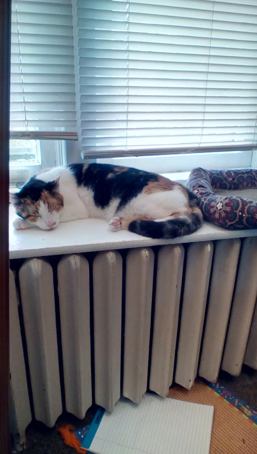

<figcaption>

Why sleep on the perfectly soft bed, when you can sleep on the shelf?

</figcaption>

</figure>

It was not a nice apartment, but it was our space. We roasted in the summer, but otherwise were pretty comfortable and on the whole, enjoyed our time there. Her favorite feature, besides the heaters, was the enclosed stairwell, which she would stampede up and down at night. It was often accompanied by what I dubbed the "Moxie Howl" which was her little, hollow meow that she used as a sort of "I'm up to mischief!" announcement. I used to hear it in our first apartment too, right before she would scale the refrigerator to get to the top of the cupboards.

Unfortunately, the somewhat-crummy-apartment was also where we had further run-ins with bats. The first July, in 2015, Moxie alerted me to **something strange(!!!!)** in the "living room" by standing on top of the TV and meowing incessantly at what I had initially mistaken for a gouge in the molding over one of the windows. When it started flying, there was a lot of screaming (on my part) and I lot of activity (on hers). It took two days of sleepless nights and a borrowed tennis racket before I was granted any peace. We managed to go the next summer without any bats, but they made a repeat appearance in 2017. All that training with the wand toys meant she was a pretty good jumper, and sadly at least one of our chiropteran visitors had a run-in with her, before I could intervene.

2017 was also the year Moxie was diagnosed with hyperthyroidism, which was a scary time for me.

<figure>

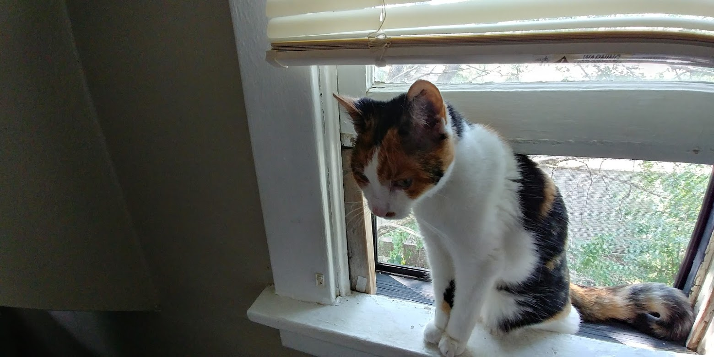

<figcaption>

Skinny Moxie

</figcaption>

</figure>

She lost a lot of weight, and it took a week of anti-nausea medication, and me mixing wet food into slurry which I then had to force her to eat, before she started to return to her old self. This was also when I had to get a lot more diligent about vet appointments, which up to this point hadn't been done as regularly as they should have been.

<figure>

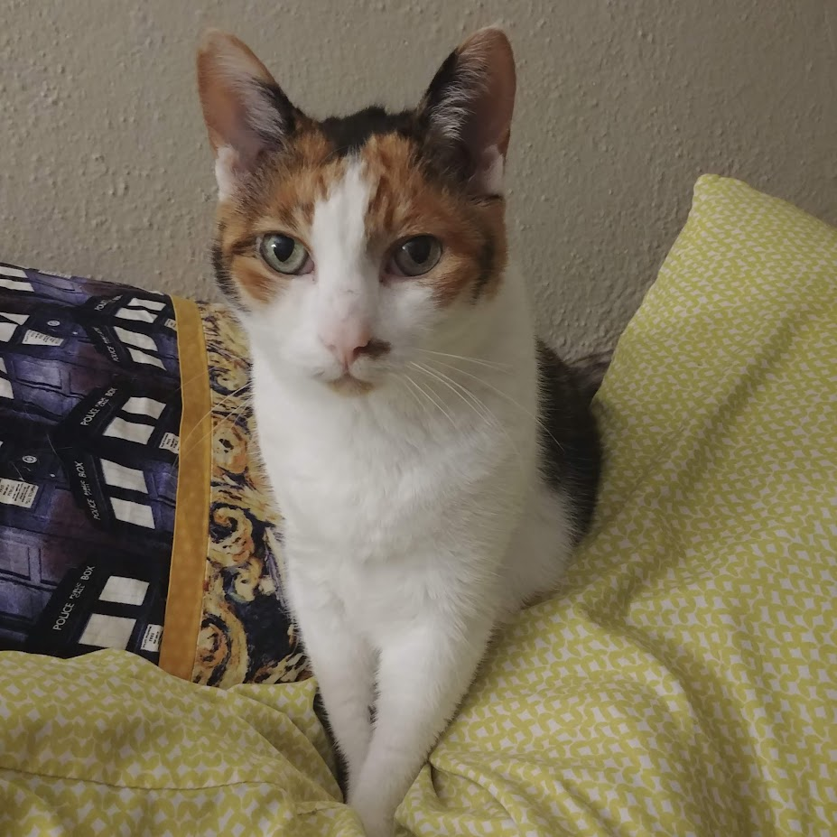

<figcaption>

One year later, she filled back out

</figcaption>

</figure>

The summer of 2018, we got through our last bat escapade with a bit more trouble on both our parts. Jumping around wasn't a big part of Moxie's repertoire at that point, and I had also returned that borrowed tennis racket. It also involved a night spent sleeping in the car, since I was too nervous to close my eyes for a prolonged period of time at that point, and I didn't want her to have any other encounters in my absence. This was the final straw for me when it came to that living situation.

Our exodus brought us to the building we're currently residing in now.

<figure>

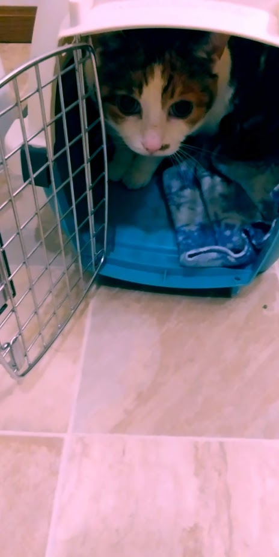

<figcaption>

Why have you brought me to this strange place?

</figcaption>

</figure>

<figure>

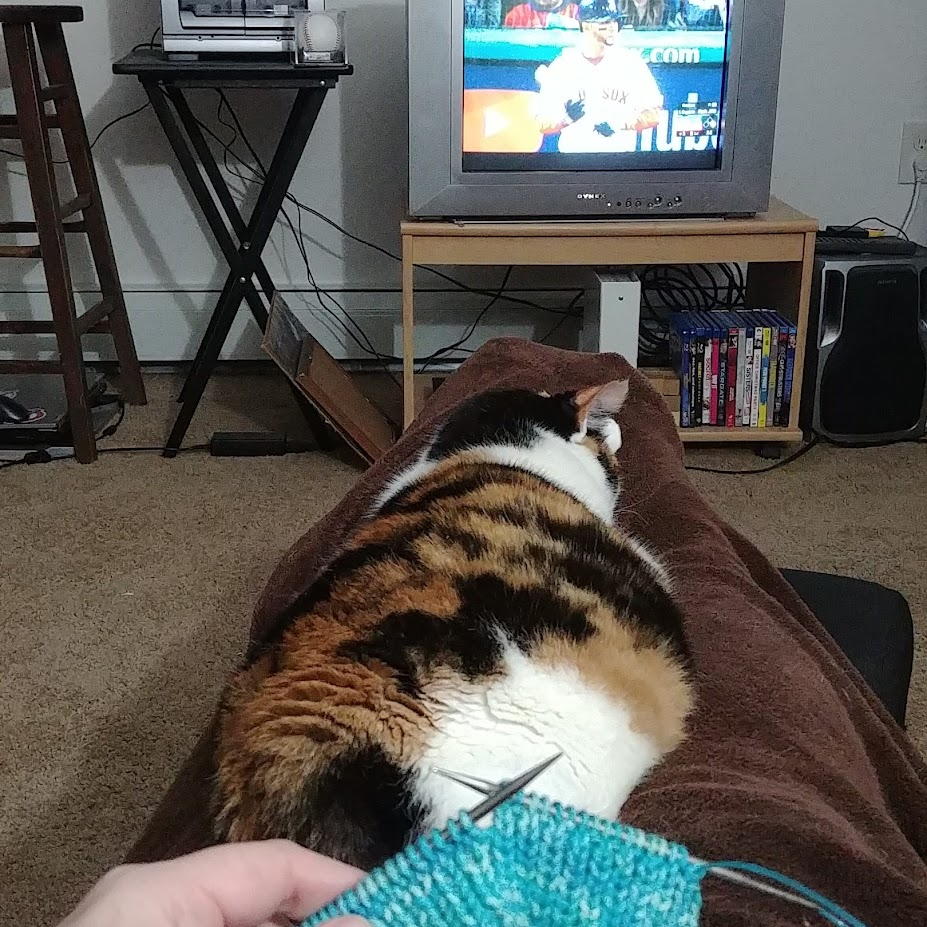

<figcaption>

My ever-faithful, baseball watching, and knitting companion

</figcaption>

</figure>

<figure>

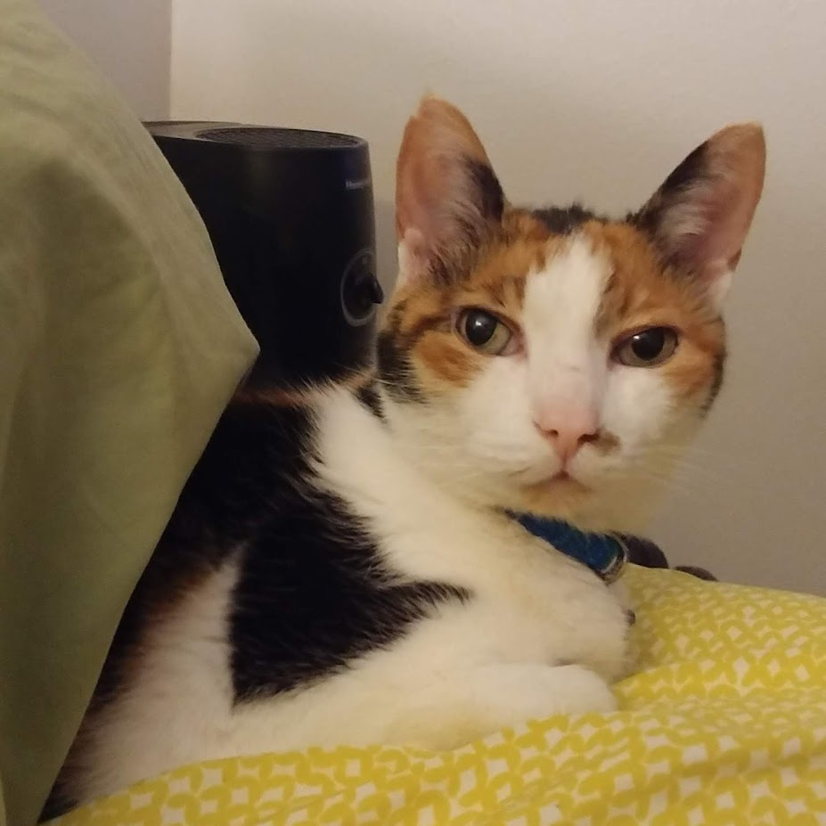

<figcaption>

Pillows are a cat's best friend

</figcaption>

</figure>

<figure>

[The most elegant way to bathe one's tail](https://youtu.be/ShX6iRkM\_7A)

<figcaption>

I loved watching her do this, because I found it absolutely adorable

</figcaption>

</figure>

Moxie and I enjoyed a pretty quiet life together for the next 6 months, before things ended up changing again.

<figure>

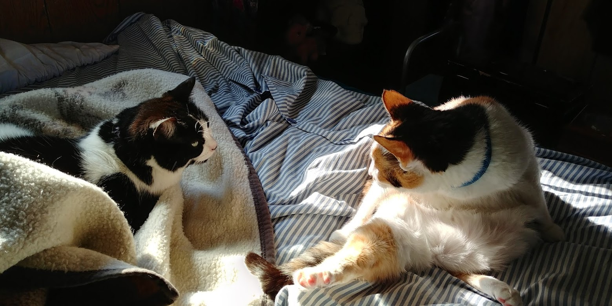

<figcaption>

Kochanski and Moxie

</figcaption>

</figure>

My girlfriend Ivory, and I decided to introduce our feline friends, hoping if it worked out okay, we could move in together.

It was a challenge, with Moxie occupying more of the cranky-elder-beast role than the last time she'd dealt with a new cat. But, while Moxie and Kochanski weren't ever really close friends they figured out how to get along. Ivory and I held our breath whenever the girls so much as sniffed each other, hoping for a mutual grooming session that never really came to fruition.

<figure>

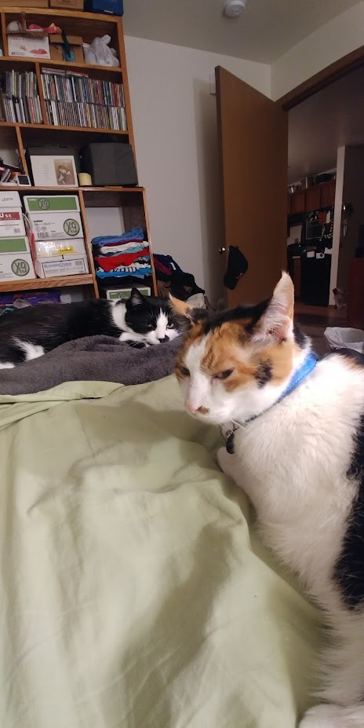

<figcaption>

Lots of side-eye, a common Moxie mannerism

</figcaption>

</figure>

<figure>

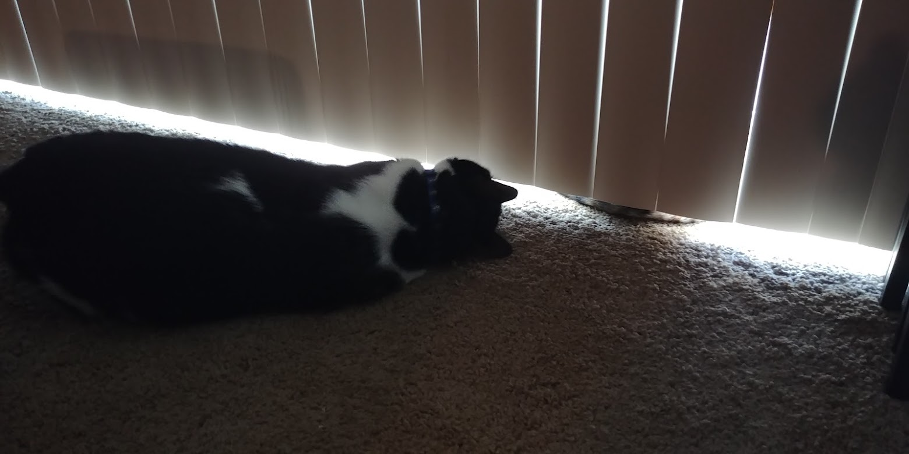

<figcaption>

Play with me?

</figcaption>

</figure>

We made it work in the one-bedroom apartment, and then moved upstairs to something larger almost a year after we'd first moved into the building. Two bedrooms, more space, a balcony where the cats could go in and out without encountering cars or people, and all the sunshine Moxie could ask for.

<figure>

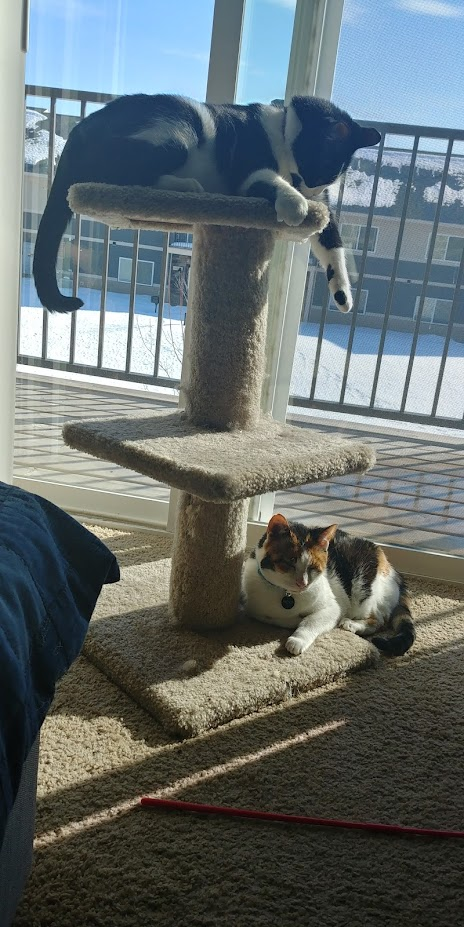

<figcaption>

Hey! Up here!

</figcaption>

</figure>

Another 6 months, and things changed again, when I started working from home.

<figure>

<figcaption>

Ever-present co-worker

</figcaption>

</figure>

The early days of the pandemic were scary, but I got to spend whole days with our cats which I don't think I have taken, or ever will take for granted.

My desk setup evolved from an uncomfortable seat at our dining room table, to a padded chair with a couple of TV trays, to finally getting a desk, and then a keyboard tray for said desk, just so Moxie could maintain possession of my lap, if she so chose.

<figure>

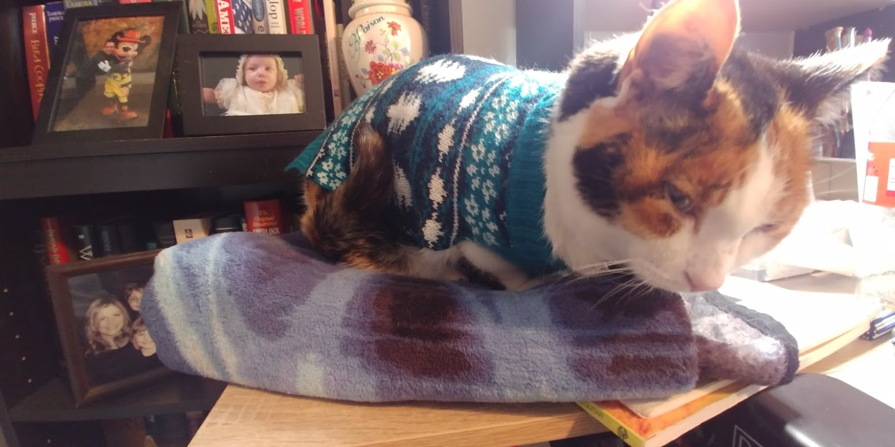

<figcaption>

Desk monitor

</figcaption>

</figure>

After Ivory would leave for work, and I would settle into my routine, I'd hear a little meow and my lap would be briefly invaded, before Moxie would take up residence on the desk, where she tended to snooze for a little while.

<figure>

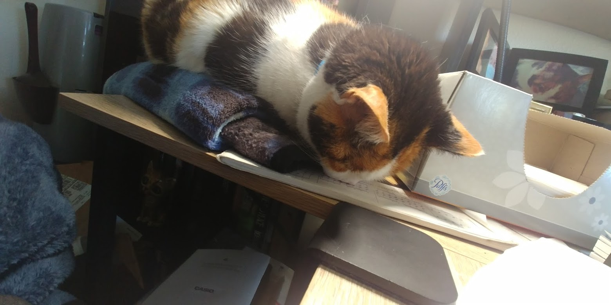

<figcaption>

Faceplant!

</figcaption>

</figure>

Of course, I kept changing my desk setup, and she sometimes found herself out of a space to sleep. But, there were still days when the couch would be too cozy to ignore, and I'd spend the day working while covered in our daggerbeasts, which wasn't ever anything to complain about.

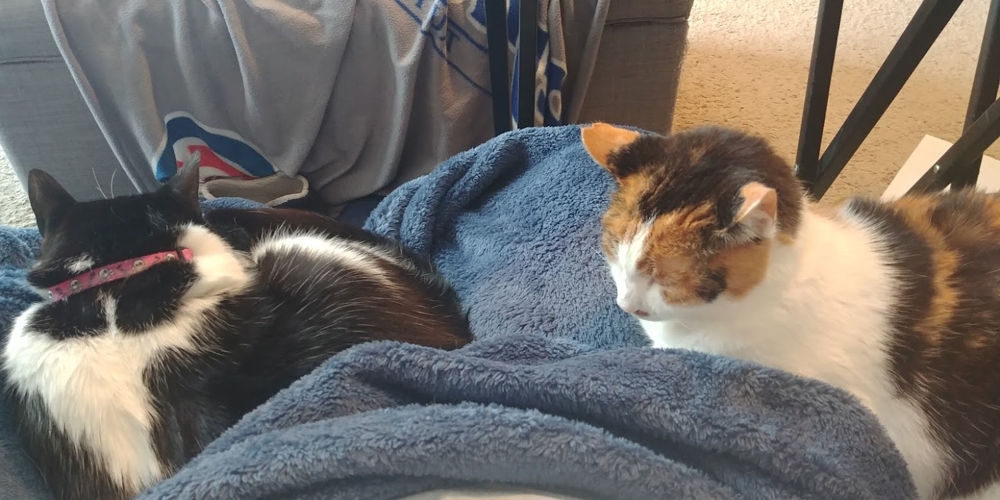

It was only in the last year or so that Moxie really did start to slow down. Fewer chases around the apartment, less interest in toys, and more anxiety, which meant she started getting a morning dose of Prozac with her thyroid med. She never lost her desire to eat, although, we did have to split meals up into two parts, and start keeping a bowl of water in the bathroom since that was the only place she was ever willing to consistently hydrate.

<figure>

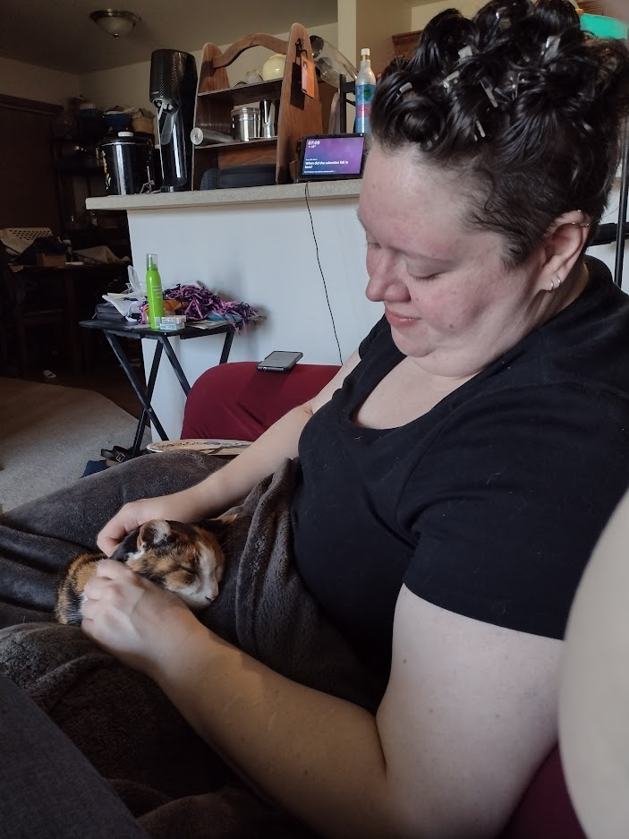

<figcaption>

Our last morning snuggles

</figcaption>

</figure>

It's hard, when you know you have a finite amount of time, and you know there's only so much to be done with that week, or those days, which somehow diminish into hours. We spent our last days together being work buddies, something she hadn't been too interested in of late, opting instead for a sunbeam, or her perch on our 1st pandemic purchase, the epic cat tower.

<figure>

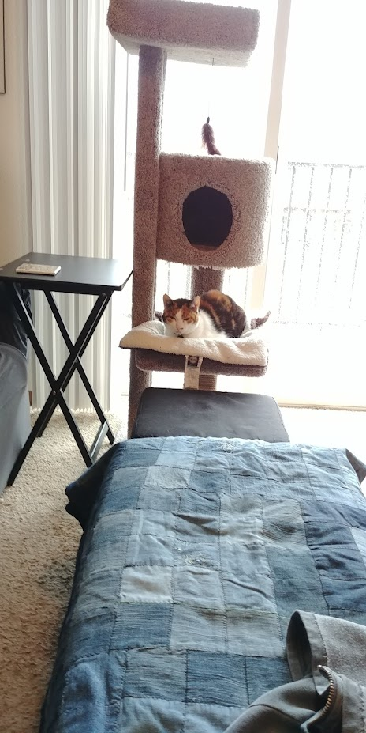

<figcaption>

This is my spot

</figcaption>

</figure>

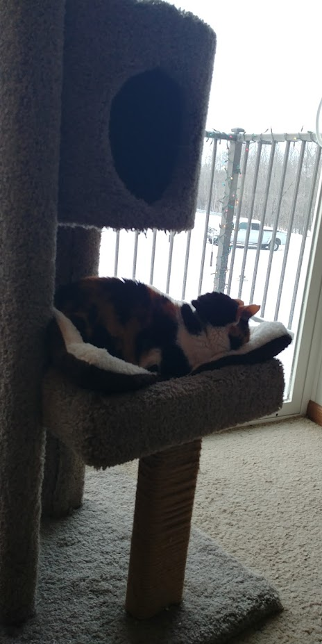

Nights were long, in the way that only insomnia can make them drag out forever. But, Moxie made the effort to climb into bed and sandwich herself between us, which I treasured. I think it was hard for her, because she hadn't been restful in that space for a while. It seems that squishy pillow-top beds with memory foam mattress pads are a bit uncomfortable for a cat with old bones, and so she usually only came for a little while, and then left again. Those visits had become pretty sporadic as well, but she was there Monday night, and every night after, until she was gone.

I regret the times I groused at her insistence on claiming that spot, because it interfered with our nightly crossword puzzling. Especially when she decided to employ what we called the "dowel feet" technique, putting all of her weight on one of her very dainty paws and digging into the tenderest parts of your body. But, that was very much her spot on the bed, and she wasn't ever going to give it up, not entirely.

Our last night together, we got McDonald's, because Moxie was always partial to their french fries. She only wanted a couple of bites of fry, but she took all of the cuddles Ivory and I had to offer.

<figure>

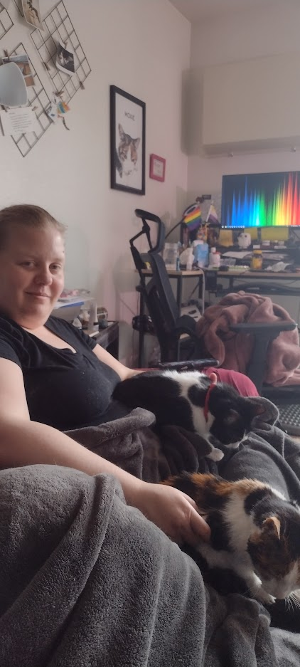

<figcaption>

Snuggletime

</figcaption>

</figure>

I keep thinking this wasn't enough time together. At the same time, to ask for any more time would have come at a painful cost to Moxie, and we wanted to avoid that. She was already in some discomfort, and there wasn't any chance that was going to change.

<figure>

<figcaption>

One last photo together

</figcaption>

</figure>

It felt like the longest walk in the world, going down the hallway to the elevator, with her carrier, knowing I wouldn't be bringing her back.

They had to give her a sedative, and make sure it had plenty of time to work, since her old bones were pretty sensitive, and she had much less patience for everyone than she used to have for me. (she bit one of the techs during her blood draw earlier in the week)

Moxie went to sleep in my arms.

Holding her that last time, she wasn't feeling the aches and pains that made being picked up such an uncomfortable trial for her. I watched the light leave her eyes a few minutes later, and I knew she wasn't there before the vet told us she was gone.

I thought that would be the hardest day, because that decision was so hard, and it was hard to go through that moment, even if I was going through it with so much of Ivory's loving support and understanding. But, it was just the first hardest day.

It's only recently, that I've come to realize just how much value I place in the habits of my life. All the little rituals that make up the course of a day. Waking up to open a can of cat food and distribute "first breakfast" while cats are precariously underfoot. Nudging Moxie over on the couch, so Ivory and I could sit down and have our breakfast and coffee while watching YouTube. Ivory getting up to finish getting ready for work, and Moxie taking up her position in the crossroads of our apartment, so we don't forget about the very important, "second breakfast." Sending Ivory on her way while the cats mill around in the kitchen, their demands for food rising in volume the moment the apartment door closes. A day of work, interspersed with requests for lap time, followed by faceplants and lots of snoring. We doled out dinner some time around 6, since that became when Moxie would take up her post, poised to get to her feet and sound the "feed me!" howl the moment someone moved towards the kitchen. And then one last round of food before we got ready for bed. My day begins and ends with my feline friends, which means right now it begins and ends with some pain. There's only one dish, or one scoop, when there used to be two, and no little howl to remind us how Moxie would tell anyone she'd never been fed a day in her life, she was STARVED!

We assembled those rituals over 14 years, and I know they're going to change in her absence. Someday, there might be another cat, especially since Moxie spent a lot of time training me up to be at least a passable cat parent. And that other cat won't fit perfectly into all these habits, and things will have to change. But, there's always going to be a part of her there. I'll probably feel it most when I miss her, but I hope I feel it in some of the happy moments too, because I am glad to have known and loved her, and that she knew and loved me too.
