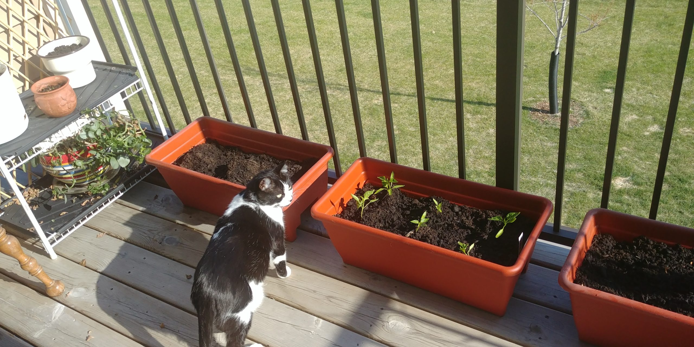
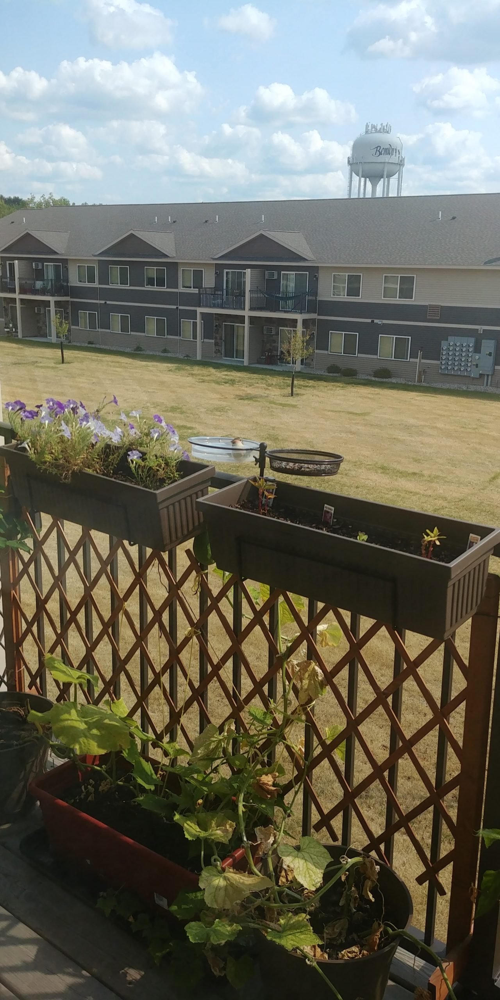
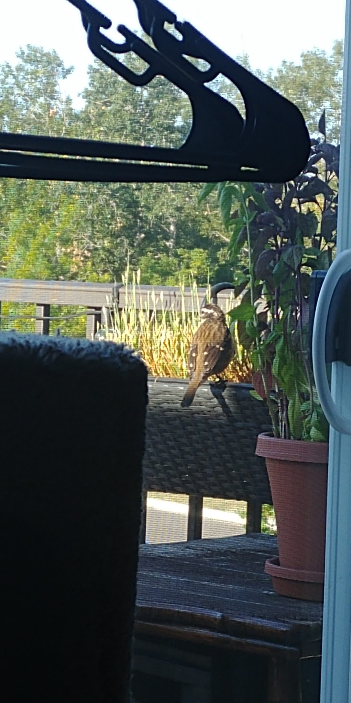
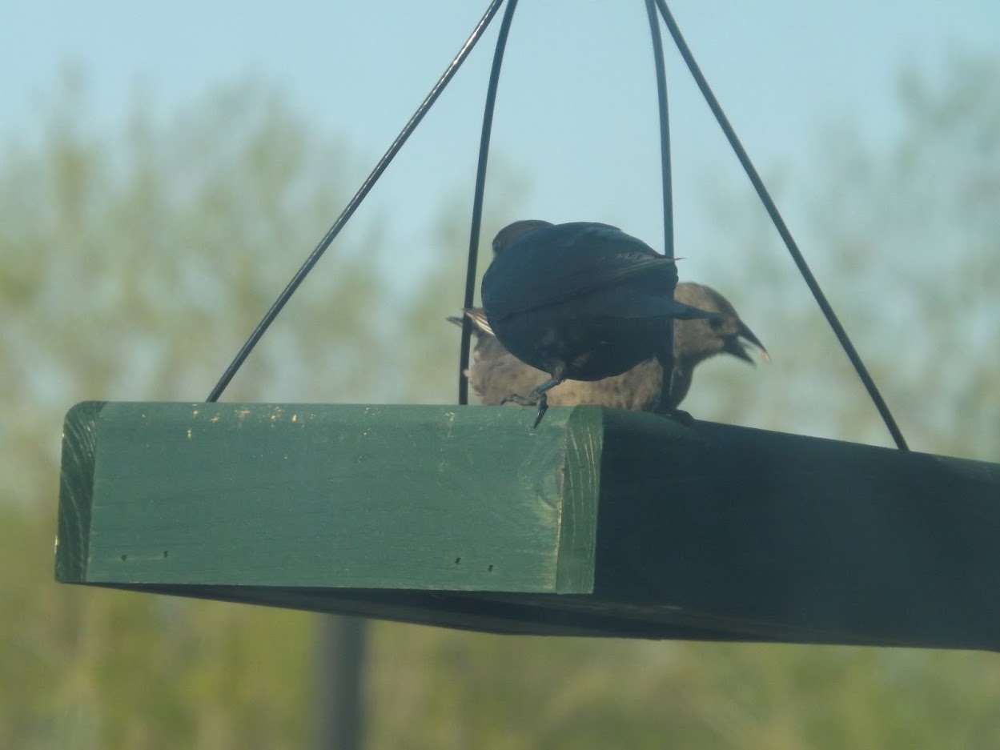
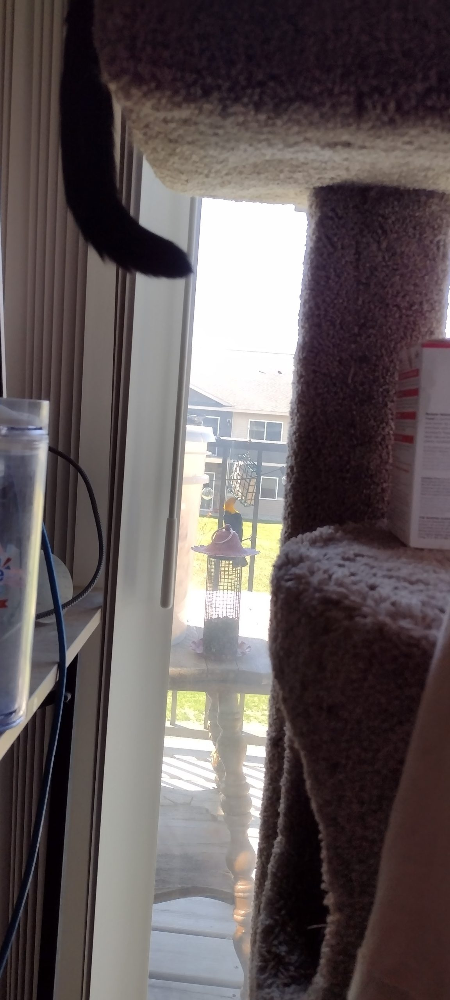
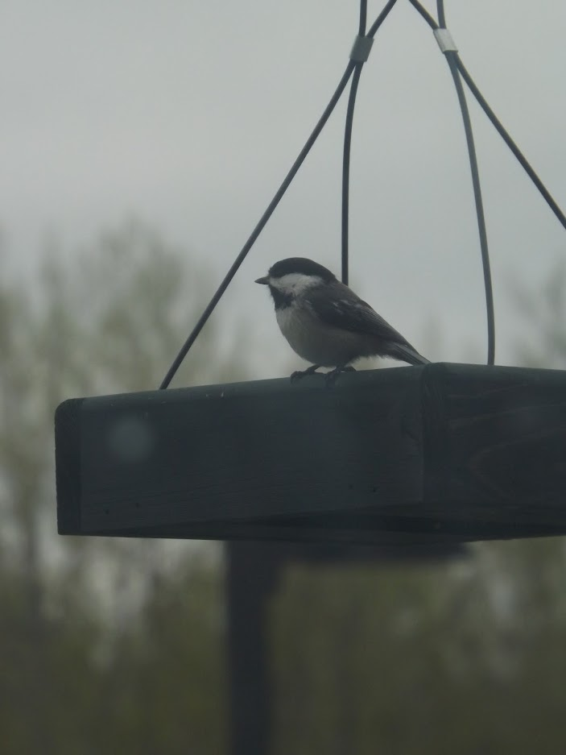
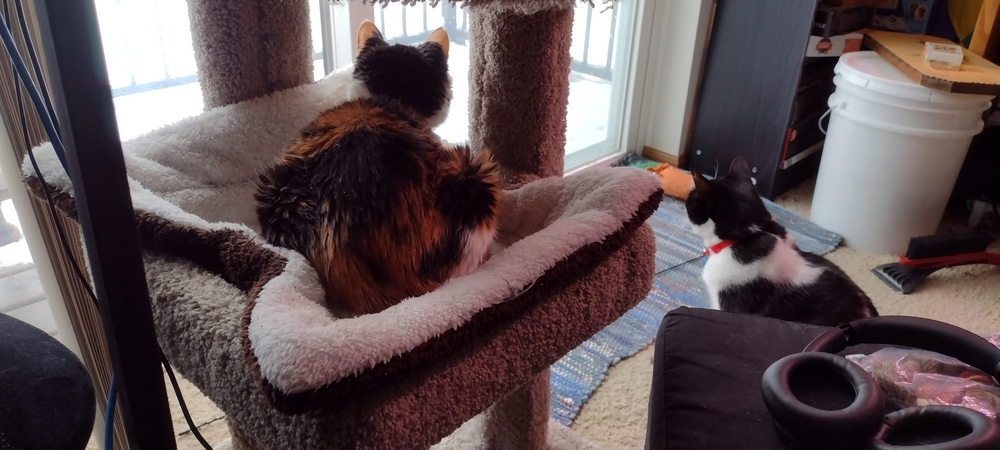

When we moved upstairs and gained a balcony, I'm pretty sure Ivory's first plan was to figure out how to turn it into a garden. My hope was to attract birds, at some point, because everyone (cats very much included) in our apartment would enjoy watching them.

Spring/summer of 2020, we went full-out container gardening, with limited success.

<figure>

<figcaption>

Squash, peppers, and onions, which turned into some blossoms, a few peppers, and very small onions which should probably have been planted deeper, or hilled at some point

</figcaption>

</figure>

<!--more-->

2021 we diversified with some flowers, thanks to getting a packet of zinnia seeds and a begonia from work, along with buying some starts which we hung from the railing.

<figure>

<figcaption>

How the petunias survived last summer was a mystery to me, because being on a south-facing balcony, in FULL SUN in the midst of an ongoing drought is basically a recipe for failure. The impatiens pretty much fried right away, and then never blossomed again, even though the ones we got said they could handle the sun

</figcaption>

</figure>

Sadly, I have no decent photos of the zinnias, which I suspect to be what initially drew our first regular avian visitors to the location.

<figure>

<figcaption>

Lisa and Frank (Ivory named them) both made some repeat fly-bys, stopping at the zinnias and at least offering some attention to the petunias, so we ended up getting a feeder as well as something to hang it.

</figcaption>

</figure>

The hummingbirds were the first repeat customers, and they stuck around until mid-August. It was always a thrill to see them buzz by. We don't have much tree coverage, which we suspect to be the main deterrent. However, Frank did figure out he could either perch on an arm of the hanger we put up, or fly down to one of the saplings below and still keep an eye on things.

We got the other feeding station set up after a visit from a couple of grosbeaks.

<figure>

<figcaption>

They mostly availed themselves of the cat grass we'd let go to seed after it got too mature for Chanski.

</figcaption>

</figure>

We didn't see much activity after the one late-morning visit, but we left the seed and water out there, especially in the late summer when it was unbearably hot and everyone kept talking about how much even bees would need moisture.

It took until November for me to realize the banging I kept hearing outside was from a blue jay, a bird which happens to be one of Chanski's favorites. Once those appeared (and we marveled at them without ever taking photos) we bought a hanging platform feeder, hoping to attract more of them.

It was mostly quiet over the winter months, especially once it got really cold. Being on the corner of a building seems to leave everything so much more open. There's a lot of wind and birds definitely have opinions about what they want from a feeding station.

We're hoping things have turned the corner, and we're now a low-key attraction.

In April, we had a small flock of house finches, as well as one of juncos. They seemed bound and determined to pick up every piece of seed that fell to the ground, and I'm definitely missing them now, since we're trying our best not to annoy the downstairs neighbors with a bunch of seed and shells dropping all over their patio. They also brought a few redpolls with them, and those seem to have decided to stick around.

Growing up, my experience of feeding birds was a silent, and somewhat distant activity. Having them a step away, with our balcony door open means I can hear a lot more of their songs, which are all very pretty.

For the better part of this month, we've been ticking all sorts of boxes when it comes to birds. The blue jays came back, we have a couple pairs of gold finches, a pair of chickadees, and a pair of brown-headed cowbirds.

<figure>

<figcaption>

Apparently brown-headed cowbirds are a parasitic species. They lay their eggs in other birds nests, and then frolic off to do whatever while someone else raises their babies.

</figcaption>

</figure>

We also got a short visit from a yellow-headed blackbird, which was probably the most excitement any of us had that day, since it flapped all over the place and seemed very enamored with strutting back and forth on our deck.

<figure>

<figcaption>

My favorite part was watching it balance between the rails while sampling our oft-ignored suet feeder.

</figcaption>

</figure>

I was certain that must have been the bird Ivory saw the morning she said we'd had an oriole, but then this week male and female Baltimore Orioles showed up at different times. Thankfully, one of them came back to have some grape jelly once I'd seen them for myself.

I'm interested to see what else we might attract once we actually have our full array of plants back outside, but so far, my greatest triumph has been the chickadees. I love listening to them and watching them hop around. It always makes me think of this print of a chickadee my Grandma Kalvig had at her house; I think it was titled something like "Winter's Cheery Survivor." Seeing them always makes me smile.

My intention of attracting the birds was mainly for the entertainment of the cats, but I've found I get just as much enjoyment out of seeing them as Chanski does. And even Moxie took some notice when our initial flocks would spend whole mornings hopping around in the snow.

I'm hoping once we have our actual container garden set up again we'll see a wider variety, and maybe an increase in the pairs we currently have.

We are trying to keep an eye on the progression of [HPAI](https://www.dnr.state.mn.us/wildlifedisease/avian-influenza.html), which has been making its way around the state. So far, nothing has been detected in our county, but it has been found in birds to the south and east of us. I'm hoping it will dissipate before it makes its way here. But, my initial fear that the birds wouldn't come back if we have to take our feeders down diminished when Frank and Lisa came back before we'd even had a chance to put the hummingbird food out.
