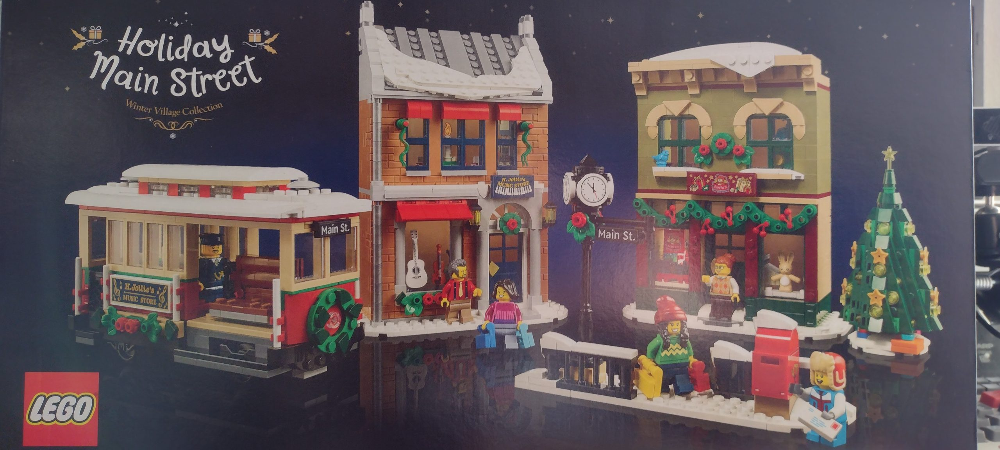

The end of January is staring me in the face, and I've got one blog post to show for the month, so this is my effort to disrupt that narrative

After several abbreviated trips around our apartment complex, we finally took our snowshoes out for a more extensive walk. Everyone who I've spoken with about snowshoeing has recommended [Beltrami County's Three Island Park](https://www.co.beltrami.mn.us/departments/nrm/Three%20Island%20Park.html), we'd never been there, so it was a pleasant discovery for the both of us. We had some surprisingly nice weekends in January, and it was a gorgeous day to walk beside a running river while there was still a bunch of snow on the ground. It also helped that we didn't have to cut a trail, or worry about getting lost since we kept running into people no matter where we were.

<figure>

<iframe width="560" height="315" src="https://www.youtube.com/embed/cfmx2UGR1vQ?si=FPxwI4RUsWbeMLma" title="YouTube video player" frameborder="0" allow="accelerometer; autoplay; clipboard-write; encrypted-media; gyroscope; picture-in-picture; web-share" referrerpolicy="strict-origin-when-cross-origin" allowfullscreen></iframe>

<figcaption>

The trail runs pretty much parallel to both sides of the river

</figcaption>

</figure>

<!--more Here's where the month went?-->

<figure>

<figcaption>

It was oddly disconcerting to have the smell of ice cold water as we walked beside the Turtle River

</figcaption>

</figure>

On the downside, after our very enjoyable adventure our alternator died while we were in the drive-thru at McDonald's. Personally, it was a rather mortifying experience, but I was at least able to find a couple of silver linings: we were together when it happened, we weren't still out at the park, and it was a nice enough day that having to stand around in what passed for the cold at the time wasn't the absolutely worst experience. Plus, an employee there was good enough to jump the car so we could at the very least get it out of the drive-thru lane so we weren't disrupting everything else while we waited.

Ivory gave me a holiday-themed LEGO set for Christmas, and I was planning on holding off for a good long while to put it together, but then I got antsy and ended up assembling it over the course of a few days a couple weeks ago. I'm really hoping by Christmas I'll be able to get my hands on a power hub now that I have tracks and I will be able to find a place for a temporary Christmas Village of sorts. (I'd like to work my Ghostbusters and Doctor Who accessories in somehow)

<figure>

<figcaption>

I have now assembled the trolley, music and toy stores, as well as the little sidewalk portion (the letter the figure is holding totally fits into the slot on the mailbox!)

</figcaption>

</figure>

I went to my first dentist appointment in a lengthy amount of time. Ivory was good enough to come with me, even though she wasn't feeling that great either. It turns out having a less-than-stellar experience with the dentist as a small child, and then not really keeping up with dental care led to a pretty hefty dose of anxiety when it came time to get my teeth checked out. There's more dentist in my future, but it's no longer coupled with some sort of unknown evil about to be visited upon me. (Anxiety for me = melodrama, it's a thing)

After almost three years of working from home with a 15" laptop hooked up to an extra monitor, my already ancient device was starting to give up the ghost. I couldn't even leave my webcam plugged in when I wasn't using it, and expect anything else to work properly. So, based on specs from my work IT person I scoured the internet until I came upon something that hit all of the minimum requirements and had a larger screen; for a surprisingly affordable price. It's not going to run a graphics or memory intensive game, but considering I mostly want to be able to continue working from home, have something to write on other than a smart phone, and I wanted the computer to be ours without any strings, I think it fits the bill pretty nicely.

And, as a follow-up to [my last post](https://peridotlines.com/blog/2023/01/03/video-games-my-history/), _GoldenEye 007_ for N64 came to the Nintendo Switch a couple of days ago. I've been playing it off and on, and while things started off rather poorly I've managed to get four missions in on the easiest setting. Considering my previous experience couldn't have lasted more than 5 minutes, I guess this does technically mean I've improved my skills, at least a little bit.
