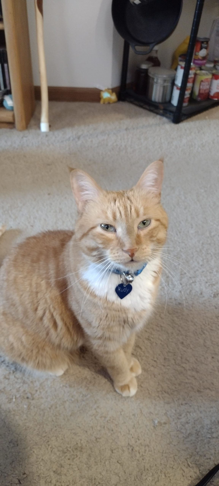

Whenever I have to recognize a year's worth of time passing, it's impossible for me not to at the very least have one round of the chorus of the song from RENT run through my mind. It's been over a year since we said goodbye to Moxie, and today it's been a year since we brought Rudy home to live with us.

Rudy was very much a surprise arrival via the cat distribution system. I was familiar with his previous owner, someone my mom had been helping take care of Rudy, while he was going through some ultimately fatal health issues. I know my mom wanted to take Rudy to her house, but they already have a resident cat, Miki, and my mom was pretty certain she wouldn't take very kindly to an interloper on her turf. So, we drove out to meet a very shy Rudy, and agreed, after some veterinary confirmations that we would be up for taking him home.

It was a bit of a rocky adjustment for him at first. Living in a house in the country, away from the road, without a bunch of cars coming and going meant the first week, he pretty much dove for a hiding spot under the bed every time someone came home and slammed a car door. Never mind that we're on the second floor, and don't have many visitors...

Once he got used to the regular level of noise, he actually turned out to be pretty unflappable. He's still not for being picked up from wherever he is on the floor, but other than that, I have to say he's usually pretty chill.

He does have some strange habits. One of the trove of toys he arrived with was something we called "the tomato" which was apparently an apple toy, from the yeow catnip company. Anyone who has cats who are into catnip has probably run across these. They have a lot of "kicker" toys, their banana being a particular favorite on the internet. But for Rudy, his very squashed tomato has been his favorite. He tends to jump on it, and then sort of dance on it with his back feet, which we find endlessly entertaining. Unfortunately, it appears to have sprung a leak, so as part of the celebration of his gotcha day, we're hoping to replace it. (We did also find a jack o lantern, which seems to inspire close to the same level of dancing frenzy in him).

He's also prone to dancing whenever he gets a drink of water. At first, I thought this was a product of the type of water dish he was used to drinking from, but it really doesn't matter, whenever he bends down for a drink, he tends to do a sort of running man thing before he actually starts drinking his water, which should always be room temperature, because if it's cold, it's unpalatable.

Rudy is very much about finding remote corners of the apartment to inhabit in comfortable hermitude, which is of course antithetical to how I would prefer to interact with any cat. (If cats wanted to be near me all of the time, I would be ecstatic) But, he's starting to ask for more lap time, especially now that I've figured out he loves being brushed, and even though Chanski believes our bedroom is 100% her domain, he's even starting to take some chances and join us for some brief snuggle time in the middle of the night.

Chanski isn't 100% sold on this whole "big little brother" thing, but they do seem to be developing something resembling tolerance. We're still a few steps away from affection, although, lately, I've caught them doing a lot more curious sniffing at each other than either of them seemed willing to engage in before. We'll live in hope that at some point they'll actually snuggle with each other without prefacing the encounter with hisses.

It's wild to me that he's been with us for a year already. His arrival was so unanticipated, but he's brought a sense of balance to things here, especially as we've learned about each other and gotten better and knowing what to expect from one another.
