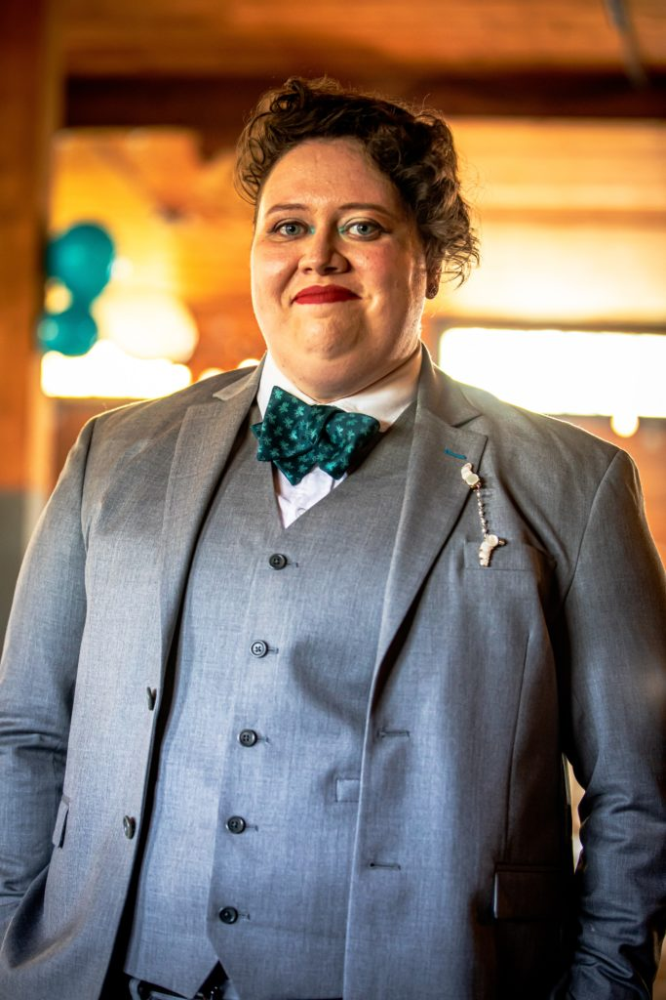

It's June! It's LGBTQ+ Pride month, and I've been so busy with life, all I've been able to do is put up some rainbow lights on our balcony and raid our local Target for whatever interesting things were left in their display. A lot of Pride has been at a distance for me this year, which feels like a bit of a bummer. It's also a challenge to celebrate when I've been finding it difficult to be out. Anyone can celebrate Pride, regardless of which side of the closet door they're facing, but having part of myself be out, and another part of myself basically chained in an oubliette is a little more cognitive dissonance than I've been able to accept lately.

In August it will be two years since I first tried on gender neutral pronouns in a more public setting. When I take a step back and think about it, I'd been analyzing my pronouns since at least 2018. Like most of the things I've struggled with, as much as I've tried to ignore it and hope it's just a phase eventually, it manages to accumulate mass until it's impossible to ignore. The mind is a limitless space, and yet somehow pieces of your identity are just scattered throughout it, and eventually it's not little pebbles you're stepping over, it's boulders that have fallen in the way of every thought. At first, maybe they're small enough to just trip over, but then you realize one day you're climbing over these things and something has to be done.

The existence of spaces where someone leaves an opening for you to share pronouns really make a difference; especially without having to actually _say_ anything, which is something else I struggle with, a lot. In 2021, the space I was in had proven to be so openly inclusive that it felt like an invitation to fully be myself, something that seems to elude me a lot of the time.

Quarantine and working from home have been a relief in a way, because I haven't had to leave what basically became a sanctuary for myself. It's strange how something can be so reassuring, yet at the same time completely suffocating. Like, I bristle internally every time someone uses she/her pronouns for me, but then there's the mental conversation of "they don't know, so it's not their fault," followed closely by "I don't have to tell them and risk being rejected."

It's not as if I've wandered the world alone since coming out as a lesbian; over a decade ago. But, I have struggled. There seems to be this endless well of internalized homophobia and shame; due to my own reactions and the reactions of others. I don't have the thickest skin, and there's still a sting, from sharing with someone, only to have their reaction basically be "ew," or imply it's a failing on my part. Coupling that experience with realizing I don't fit within the gender binary and I'd prefer to use they/them/their pronouns, especially in today's political and social climate... well, I'm not sure I have the confidence to say "this is me, take it or leave it" and completely mean that statement.

Going the last not-quite-two years mentally and vocally referring to myself as "they" instead of "she" never felt uncomfortable. Or at least, it didn't until I really started thinking about actively sharing this fact with more than my wife and a few close friends and family. On the surface, it feels simple to say I don't feel like a girl but I also don't feel like a boy. The idea of explaining this to people who may or may not understand or respect it is harder. Part of me thinks I'm underestimating my friends and family, but at the same time, it's hard not to want to shore up my defenses going into these conversations, because I don't feel equipped to experience derisive questions, or outright rejection.

It's strange, how many conversations I've been present for that have made me check the locks on my little nonbinary closet, just to be sure things are secure. Some of that reaction was making sure I was safe. But I was also fighting myself, because the discomfort in those moments hasn't just been knowing I'm among a group of people who would potentially be unkind if they knew the truth. Sometimes, it's been fighting the voice inside me, when they've wanted to just blurt out the facts as an act of defiance.

In theory, there's something I find satisfying about being very overt in my queerness, because I spent so long either not recognizing or hiding these things about myself. In practice, the idea of "pushing my identity" or just being more obvious about it, in what could be seen as a confrontational manner is pretty much antithetical to my entire being. I'm almost always going to be inclined to remove myself from the scenario rather than have my presence be a problem for someone else.

I thought I would be able to continue wearing subtle hints of my identity, things missed by some and noticed by those who seem more able to see them. It feels like cheating, to wear a pin or a sticker with my pronouns, and have someone else initiate the conversation. Of course, the people who have taken that step haven't required an explanation of what "they/them" means, which also feels a bit like cheating to me too.

I don't understand why it feels like adversity is necessary for it to mean something (to me). It's not as though the positive conversations were insignificant, because I probably remember those better than the gray disappointment of the negative ones. If anything, it sort of feels like I was able to savor the good conversations because of the bad ones, even if that doesn't make taking the risk for it any easier.

I fear the risk. I fear the malicious misgendering. I fear the people who know, but are uninterested in making the effort. I fear being inconvenient.

On the other hand, I'm tired of not being able to be who I am. I still have a lot of work to do, but for now, I'm going to try to step more into being myself and being nonbinary. I can't say that I'm not a little bit scared, because at some point, there are going to be conversations again, but right now... well, this is me: nonbinary, using they/them pronouns.
