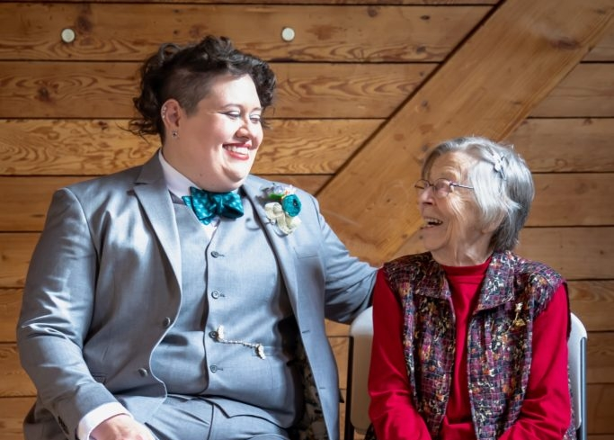

[My grandmother passed away](https://www.ceasefuneralhome.com/obituaries/Marie-Emma-Gustafson?obId=28230823#/obituaryInfo), in an unexpected sort of way. Missing her is a surreal kind of grief, because she lived a full and happy life but I, along with the rest of her family have been robbed of her. I want to wail about how it's unfair, but this is one of those times when I can't skirt the fact that "fairness" isn't a guarantee. So, I'm angry, sad, resigned, and maybe a little bit relieved; because the realities of aging and dying are sometimes unpleasant, and while things were ugly that ugliness was brief in the grand scheme of her life.

Part of me exists in this realm of memory at the moment. I tell myself it's my brain sorting through everything, trying to patch over the hole she's left with all of the times we shared, sort of shoring things up in my own mental existence, affirming that these moments in time were real, tangible experiences. But those memories are somehow both too abundant and insufficient at the same time. I worry I'm mangling them, crushing all of them together so they're all mixed up in each other.

It means lately I talk in memories. There are some that belong to both of my grandparents, so my wife has heard smelly cheese stories, and more idle references to my grandfather in the past couple of weeks. It's one of those random ADHD things, where proximity seems to make things sharper, or more present in my mind. So, I'm just a bit closer to all of these memories right now. In a month, they might drift away, which could dull the sting a little bit. Come fall, I'll be feeling that itch that it's time to be collecting and processing everything from a garden we don't have, and I'll miss her. I'll start planning my Christmas presents and even though I hadn't knit her a pair of socks in a couple years, I'll probably still think about it, because she got so many pairs from my mom, my sister, and me. Easter will be entirely unpleasant, because that was the best candy holiday, so centered on quality chocolate, something she enjoyed. And when the lilacs bloom again, I'll hunt down the most fragrant blossoms and bury my nose in them the way I watched her relishing them when we were walking out to the garden.

At her funeral, so many people talked about her culinary skills. A lot of the sense memories I have are from her kitchen, but she wasn't just a cook or a baker. She was a gardener, a crafter, and a pretty adventurous canner. I'm glad I have so many memories of her when I was a child, but I really savor the fact that I got to have so many more memories of her once I became an adult.

I think the twist with all of these memories is the finality attached to them. You can't always know when it will be the last time you share an experience with someone, especially when it comes to annual traditions. There will be no new memories with my grandmother, and now I have to rely on all of the knowledge she passed to me, and hope that I understood it well enough to get by without her steady hand.

In a tiny, slightly-unrelated ray of sunshine, I did realize today that sometimes the feeling of a memory changing isn't always a bad thing. I've been indulging in a lot of nostalgia lately, something that seems to keep me just a little more grounded. I was listening to Imogen Heap's _Ellipse_, an album I used to listen to a lot, and the song _First Train Home_ has some lyrics that have always resonated with me.

```
Want to get on with getting on with thingsI want to run in fields, paint the kitchen and love someoneAnd I can't do any of that here, can I?
```

I used to have a lot of longing when it came to this portion of the song. I was unhappy. I was lonely. I felt stuck. I would hear those lyrics and be so full of want and sadness that I couldn't help crying. But, I heard them today, and my body reacted the way it had been sort of been trained to, and then stopped short, because something had changed. I could still feel the want, and a little bit of the sadness, but it was different now. It used to seem pretty hopeless and unlikely to me that I would ever answer the desire in those words. The person listening to those lyrics today isn't unhappy, lonely, or stuck, at least not in the way they were years ago. The sadness and loneliness right now are grief, and the stuck... well, that's more trying to figure out where the next step is, instead of feeling stymied or waylaid. There's also a bit more hope tied to those words now, because these are things I can want with more possibility they'll be fulfilled at some point, especially with someone I love.
