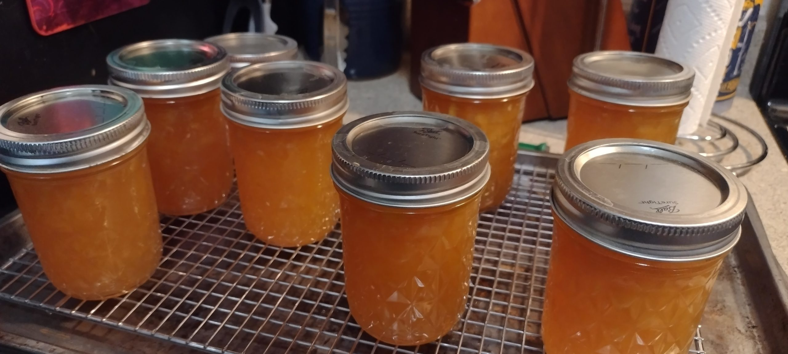

Friday night, we found out a fruit truck was going to be coming through Bemidji the next afternoon. Our plan was to have a relaxing, easy-going weekend. However, something about a lug of peaches being on offer derailed that for me. I didn't even have to finish the thought for Ivory to know I wanted to try my hand at some peach jam.

I remember one year my grandmother seemed to keep coming home from the grocery store with peaches, to the point that my grandfather may have spoken to the grocer and told him she wasn't allowed to leave the store with any more of them. She made a lot of jam, but she also canned them and made cobbler (which is 100 times easier than the dumplings we've made in the past). I never helped make the peach jam, but I did assist with jellies a couple of times.

The nice thing about everything we tried yesterday, was none of it required using the actual pressure parts of the pressure cooker we had available. It's probably about a third of the size of the ones my grandmother had, so we worked in a couple of smaller batches, and struggled a bit with water that seemed to always be boiling over. But, nothing caught on fire or exploded (at least, not yet anyway).

I think for a first-time attempt this whole operation went about as well as could be expected. We managed to fill (AND SEAL) 19 jars with peach jam, and we got 8 pints of sliced peaches (4 of them spiced with a stick of cinnamon). Our very first batch of jam seems to be a bit more on the liquid side, but I think we hit our stride pretty well when it came to the second batch; considering we ended up with quite a few extras that round, and it seems to have firmed up well in the jars. (ETA: We tried some of it for breakfast Tuesday morning, and surprising no one, it tastes like peaches! Also, it's delicious.)

It was a pleasant (though not at all relaxing) way to spend a Sunday afternoon, especially since the air quality was so terrible over most of the weekend that being outside for any length of time was miserable.

I got a little emotional before we started, because I couldn't believe we were going to attempt to can something. It's the first time I've ever done that without my grandmother. It had been a few years since I'd done any of this stuff, but the rust came off the gears as I started going through some of the motions, and eventually a lot of the training I had in Marie Gustafson's canning kitchen came back to me. It was a relief to find out that knowledge was still there, and I felt so much gratitude to her, even in the hectic moments.

Having had some success with this round, I'm wondering what other small batches of things we could add to our pantry. We don't need to be perpetually stocked in jams, but it doesn't seem out of the realm of possibility to find some savory options. Although, I'm a bit wary of the pressure cooking aspect of this whole thing. Maybe that will be our next big adventure.
