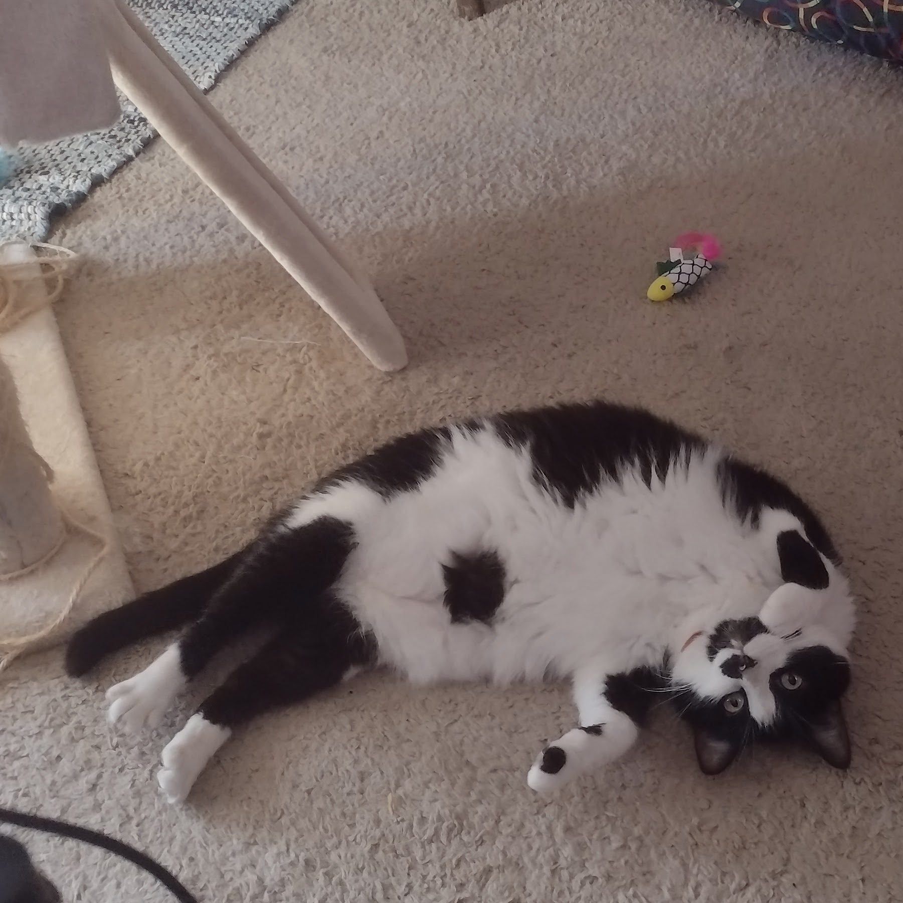

>What are you curious about?

I don't think of myself as a curious person. If I'm being honest, I feel more nosy than anything else.

I associate curiosity with the word "why," a word I don't feel like I use all that often, at least not when it comes to my personal life. I use it a lot in my day job. But it's less out of a sense of interest and expanding my knowledge, and more me looking for an explanation for the course of action we're taking, or possibly looking for a reason I can't justify speaking in passive aggressive sentences for the rest of the day.

For all that I don't prefer the company of many people, they're probably the thing I'm most curious about on a day-to-day basis. It seems trite to say it, but sometimes what makes someone tick is a complete mystery to me, and I don't really feel comfortable asking someone why they are the way they are. It's a pretty personal question, if you really think about it. A lot goes into someone's personality, both internally and externally, and while I can't put a finger on exactly why, it feels like it might be rude to just outright ask someone "why are you like this?" It could be meant very innocently, but there's something a little accusatory at the heart of that question, if someone isn't expecting it, or maybe it's just in how you ask the question.

So, instead of outright asking, I make a lot of assumptions. I'd like to think they're informed assumptions. I hear someone tell a story about their childhood, or talk about something they do often, and it starts to paint a picture. It's a pretty blurry picture, but considering it feels like I spend a lot of my life squinting to make out the details of people and their lives, it doesn't feel like it's that much of a stretch in the end.

It's also possible that I very much internalized how "curiosity killed the cat." Apparently "satisfaction brought it back," but that particular part of the proverb didn't really feature whenever I heard it referenced when I was a kid.

There is something to be said for the bit of satisfaction I feel when it turns out the puzzle I started piecing together about someone comes together and it turns out I was on the right track. Sometimes, it feels a bit like looking at one of those magic eye pictures, or at least, I think it does? (I've never been able to get those to resolve into the pictures I saw in the back of the books.) People can present a lot of intriguing and entrancing images, and then you sort of step back and see all of them together and you just know who they are. I wish it could always be a satisfying experience, unfortunately, sometimes it's also disappointing.

<figure>

<figcaption>

The only other thing I'm ever curious about is what this cat is thinking

</figcaption>

</figure>
