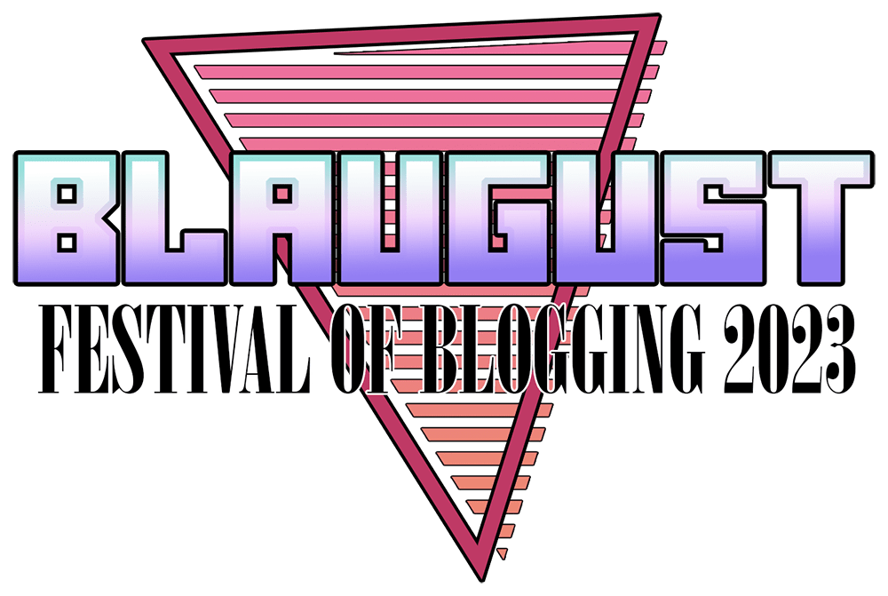

Yesterday, I threw together my writing prompt based post, went through the ritual I've seen others use to share their post on any algorithm based social media site, and then immediately complained about it to my best internet friend. I'm sure there's some definitive information somewhere on the internet, about what you should and shouldn't include in a blog post, and what should or shouldn't be used when you decide to "advertise "it somewhere else online. My biggest takeaways have been that everywhere sort of penalizes you for linking to a place outside of their walls, but you might be able to avoid the penalty by including a photo, bonus if you decide to link to the thing in your comments, rather than directly in the post. Is that the most helpful thing for someone who follows you on Facebook or Twitter? No, of course not. Is it annoying as all hell to go through those steps every time? 100% yes. Especially when I don't have much of a following to begin with, and the only engagement I end up seeing is from comments on Facebook.

After airing my grievances and chatting with my friend for a little bit, I decided to poke around on Mastodon and see if there's any sort of blogging community in existence on that platform, since Twitter is proving to be completely useless these days.

Somehow, I managed a very timely stumble across a post about [Blaugust](https://aggronaut.com/2023/07/12/blaugust-2023-is-coming/).

I'm not sure I can adequately describe just how happy I was to find something like that. I think mentally, I may have been transported back to 2010, when I worshiped Google Reader, because RSS feeds made it possible for me not to have to remember to visit a myriad of sites around the internet on a daily basis. Many of the sites were cat foster blogs, but there were also so writers, and Lifehacker, and it was my happy little oasis where I could follow up on so much at my leisure.

Twitter and Instagram managed to subsume a lot of that domain in the last 10 years, especially in Google Reader's absence. I enjoy being a reader on the internet. Give me an engaging blog post or an article, make me scroll for a little while; to get lost in some words. Except that I'm all out of shape for that kind of reading now. All of my content consumption happens in drips and drabs. Carefully meted out Twitter threads, or TikTok (sometimes chopped up into 5 part reels on Instagram) seem to be the only way I engage with content these days, and getting used to that kind of format makes sitting down to read something meatier more difficult than I would like it to be. It also makes it really hard to attempt constructing something longer for myself, because while I might benefit from whatever I've posted on the proverbial page, it's hard not to think "Who else is going to care about whatever it is I have to say? Is there any point?"

Somewhere along the way, I lost my connection to any sort of niche community on the internet. It's frustrating, to have come into adulthood online, and then watch every place I congregated eventually crumble whether its due to mismanagement or just the passage of time and the whims of internet fandom changing. I have a very knee-jerk reaction when someone brings a new (usually unrelated) fandom into what I perceive as an existing fandom space; it's almost always "no, thank you." It feels foolish and petty whenever it happens, but it's next to impossible for me to fight that instinct within myself. It pretty much means whenever someone decides they're going to spend more time talking about the new thing, I end up getting annoyed with the subject altogether. I'm sure it's kept me from experiencing incredible movies and shows, but I'm not sure the effort to overcome that level of annoyance has ever proven to be worth it. Usually, I have to wait myself out, because the thought of sitting down to watch something I'm not interested in but have seen someone rave about daily online for weeks makes me want to tear my own skin off.

I like the idea of Blaugust. If nothing else, I'm hoping it will give me a bit more motivation to post through the rest of this month. And, maybe if it motivates me, and it motivates others, I might find something interesting in another corner of the internet.

I miss talking with people online, whether its about our shared love of a show or activity, or just the mundanities of life. Somehow, I lost sight of that connection and it's been more about sidestepping debates or entirely avoiding the comment section, except that as an introvert, if I want conversation with anyone, that's probably where I will end up finding it. So, this is my attempt to head in that direction, with the hope that eventually I'll be less of an internet hermit.
