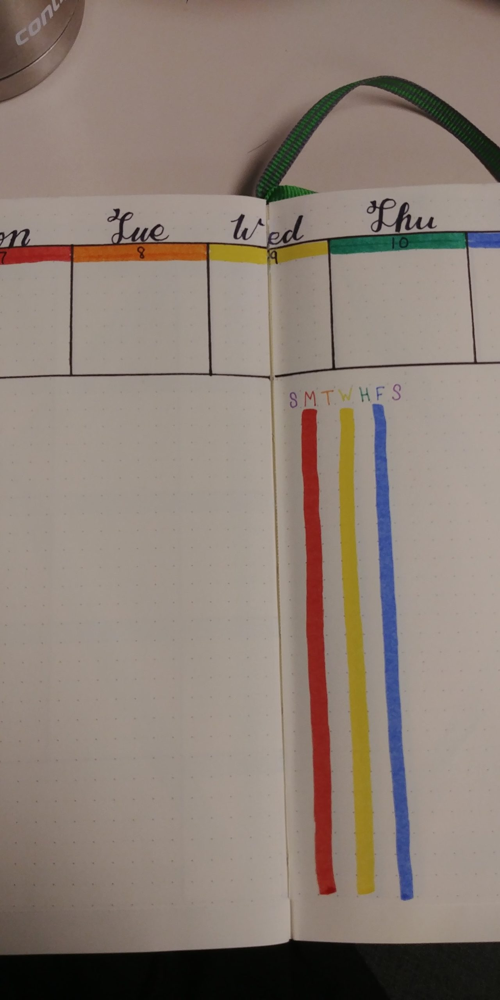

In the recesses of my mind, is a memory of receiving a "student planner" on my first day of seventh grade. They gave us these things and made it seem like they were going to be our literal keys to navigating the halls of the high school, and I remember using it with a limited amount of success. It was useful to have somewhere to write down deadlines for assignments, or have somewhere to look if I needed to know when our next break was coming up. It was useful enough, that I'm pretty sure I spent money on a college-branded planner every fall and used them with a limited amount of success.

I then went a solid decade without using much of a planner for anything. It wasn't ideal, but, I spent most of my twenties and early thirties not really worrying too much about tracking tasks or making sure I noted when an appointment would be happening. I did pay attention to the various note keeping methods Lifehacker used to promote. There was the "hipster PDA," literally a stack of index cards held together with a big binder clip. They touted the importance of to do apps like Remember the Milk, and their own text-based to-do app. And then... someone suggested Bullet Journaling, and it was all downhill from there.

The basic premise of a Bullet Journal is to maintain a list of items you're working on, you migrate them to the next page if they're not finished, you keep a running list so nothing really gets left behind, and its all there at your fingertips without the need of booting up another app on your phone, no need to pay for internet or data, just pen and paper, and you're set. Except I do nothing by halves when it comes to hyperfixations, so it quickly became about getting the "right" Moleskine notebook, the right pen, and eventually the "perfect" layout.

If you were to Google "Bullet Journal" right now, I'm pretty sure you'd be hard pressed to find an image of the bland bulleted lists in the first few pages of results, because the internet took this concept and ran with it. People make these daily spreads that are gorgeous, themed, and maybe even helpful in getting things done.

<figure>

<figcaption>

The start of my 2021 June Weekly spreads

</figcaption>

</figure>

For me personally, I learned that I'm best off sticking to a hybrid model. I adapted to a pseudo weekly spread, where I could see what I had to do on any one day, but I also had a view of what laid ahead for me in the week. At one point, this was useful to me. I knew what I needed to get done on any given day, and in turn, I would know that I was still keeping a good pace for all of the work I needed to complete in a given week. Plus, with this set up, if something came up or I just utterly failed at task initiation it was set up for me to just drop a little ">" into the column as a visual cue that I'd moved it to the next day.

But, as with every task management system I've ever employed, it seems to have hit a critical failure point and no matter what I do, I can't bring myself to focus on the damned thing. Part of it may just be because this year's bullet journal notebook found its way into my purse and as with every other item I put away for the sake of organization, it then ceased to exist. Maybe, the act of complaining about my own inability to task manage, I will in turn be motivated to take it out and start using it again. Because for as frustrated as I am with myself and this presumably-failed task management system, I still kind of love it.

Bullet Journaling caters to my obsessive pen and notebook collecting needs. It let me hang onto the sensation of putting pen to paper, like I was still fifteen and obsessively pouring my thoughts onto the page. It got me into pointed and brush pen calligraphy, and even a bit of watercolor. I just wish it was half as satisfying to employ it as is was to design it. Because I obsessively designed my 2023 bullet journal. Every month got its own special cover page with a rainbow-themed geometric design. I was going to track my mood, my period, my outlook on the months, the quarters, the year... it was going to be a little glance into my brain I could look back on in the future, and instead, its sitting in a pocket in my purse, being utterly ineffective.

Part of my consternation comes down to the fact that back to school supplies are popping up everywhere right now, and there's still some ingrained need within myself to start getting organized. September rolls around, and the first thing on my calendar is a reminder that I need to start planning any Christmas gifts I'm going to make. The unwritten reminder there has also become "you'd better start putting together your planner for the coming year." With that reminder just around the corner, I'm not sure if I'm going to put in the effort this year or not.

So much of my frustration is also due to my habit of internally throwing up my hands the moment I get out of a routine, declaring it useless, when it is still working fine, and in fact, many things would be working quite well if it were still being put into practice. Just because several months in the middle are going to be entirely blank doesn't mean it's entirely useless. The reality is, I probably wouldn't need to look back at it for anything, and if I use it more as a tool for now instead of a record for later, maybe it would be more useful.

Check back next week to see if I've even touched this relic of an item, and gotten my tasks more under control...
