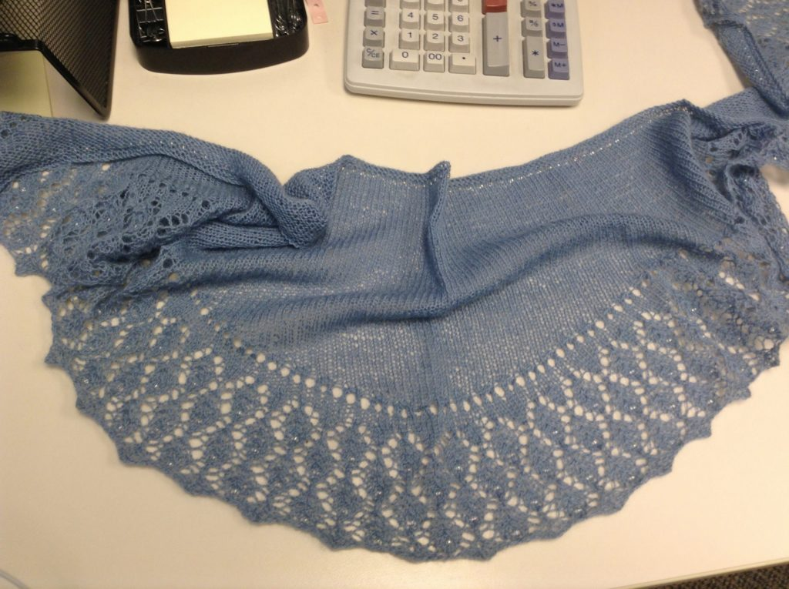
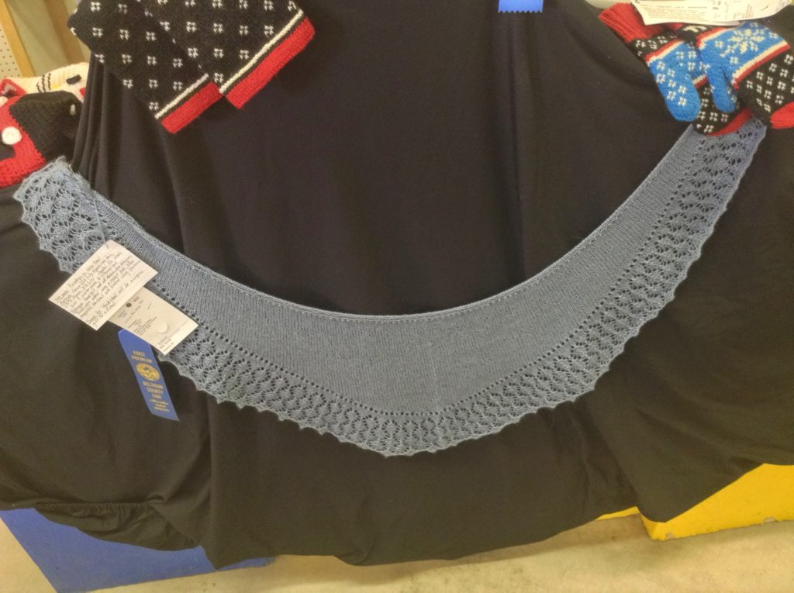
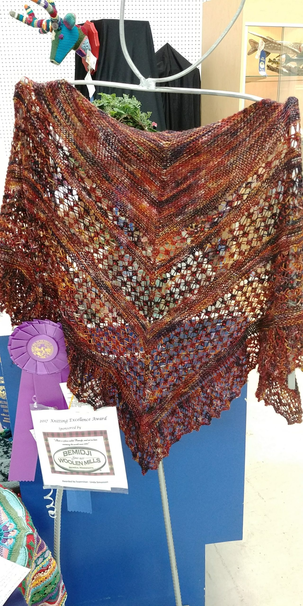
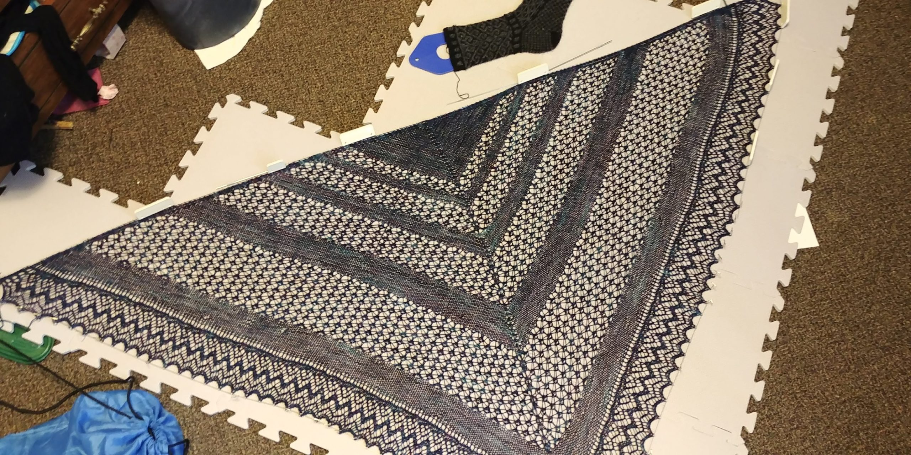
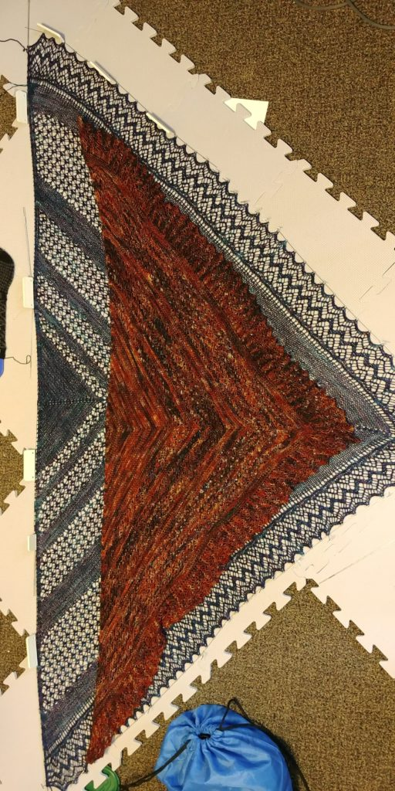
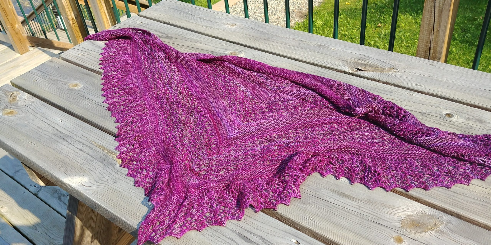

Our county fair is happening this week, so of course my digital memory banks keep popping up with photos from the two times I was ambitious enough to put items in for judging.

Both shawls involved beading, which I still find totally fascinating as part of knitting a project. I remember when I first came across the pattern and the required bead count, I was a bit horrified because I was remembering my mom's knitted bead projects and how she strung all of them onto the yarn before she even got started. With the fine weight I was planning to knit with, that seemed like a recipe for disaster. But, then I found out about adding them with very tiny crochet hooks was in love with the idea.

<figure>

<figcaption>

A lace shawl I knit from a one-skein pattern book, the first time I ever knit with beads

</figcaption>

</figure>

<figure>

<figcaption>

I managed to get a blue ribbon

</figcaption>

</figure>

My next project involved a bit more digging around online. The thing I liked about my first project, was how the beads weren't making a very obvious pattern, they were just sort of highlighting the lace pattern. I liked that they sort of became this little twinkling star at the center of each of the lace shapes, and I wanted more of that, but I had a lot of trouble finding anything similar. Then, a friend pointed out some of the projects people had shared on Ravelry, and how someone had added beads to Jared Flood's Rock Island Shawl. As a long-time Brooklyn Tweed fan, this was the best of both worlds. I picked a yarn from my stash, found some beads at JoAnns, and had so much fun working on my next project.

<figure>

<figcaption>

I was pretty proud of that champion ribbon, especially since I had modified the pattern to add as many beads as I could manage.

</figcaption>

</figure>

I liked this pattern so much, I ended up making two more versions of it as gifts

<figure>

<figcaption>

Look at how much bigger this one ended up being (there were 2 hanks of yarn involved)

</figcaption>

</figure>

I love how blocking lace adds a whole new dimension to a pattern. So often, my projects look very lovely when they're on the needles, and a lot of that is down to picking pretty yarn. But, then they're pinned out and the points are allowed to really shine and there's nothing quite so satisfying as taking a completely finished project off from the blocking boards, trimming the ends I've woven in, and having a finished project.

Working from home for the last 3 years has unfortunately cut into the times I would wear these items, and in turn, I've been less enthused to knit scarves and shawls. They're the sort of thing that I love to make, but they tend to pile up over time. So, I probably would have to start giving them away, because I know that selling them would be the least satisfying option. (Knitting lace like this takes SO MANY HOURS and while I'd like to think I don't go crazy with expensive yarn, I do pick some pricier brands a lot of the time, so selling a shawl for what it's "worth" would be next to impossible for me)

As the weather starts cooling down, I have a big project that's been sitting in timeout because I have to take out and reknit an entire section of short rows that I did incorrectly, and I just couldn't face it when I first realized the mistake. But... I think I'm almost to the point of wanting to take it out and finish it, because I am pretty close to that point. We'll save photos of that for another time.
