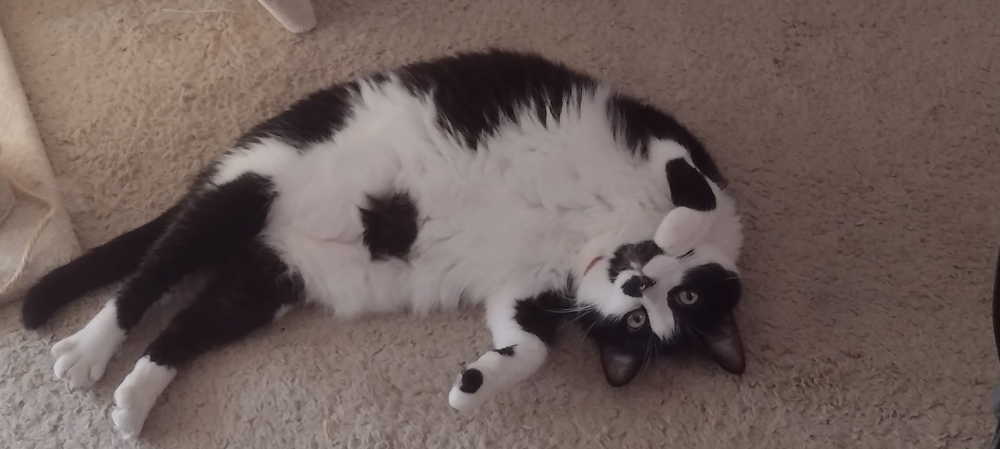
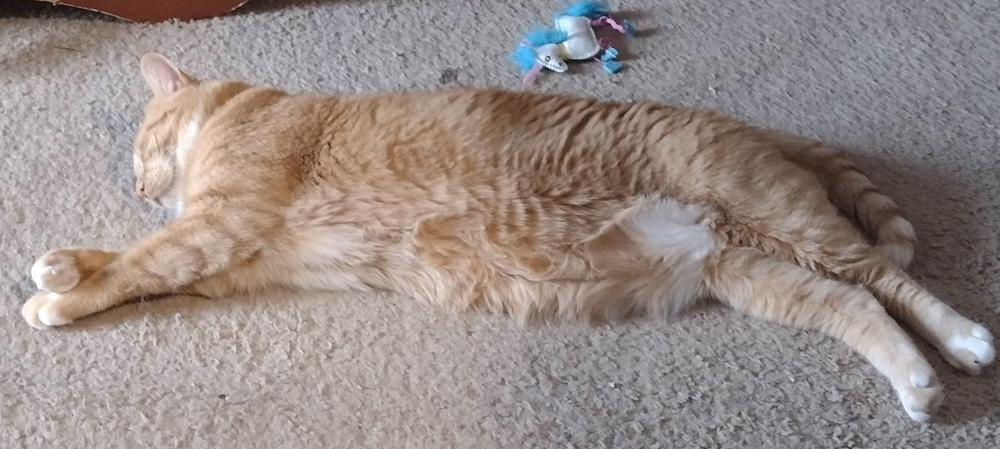
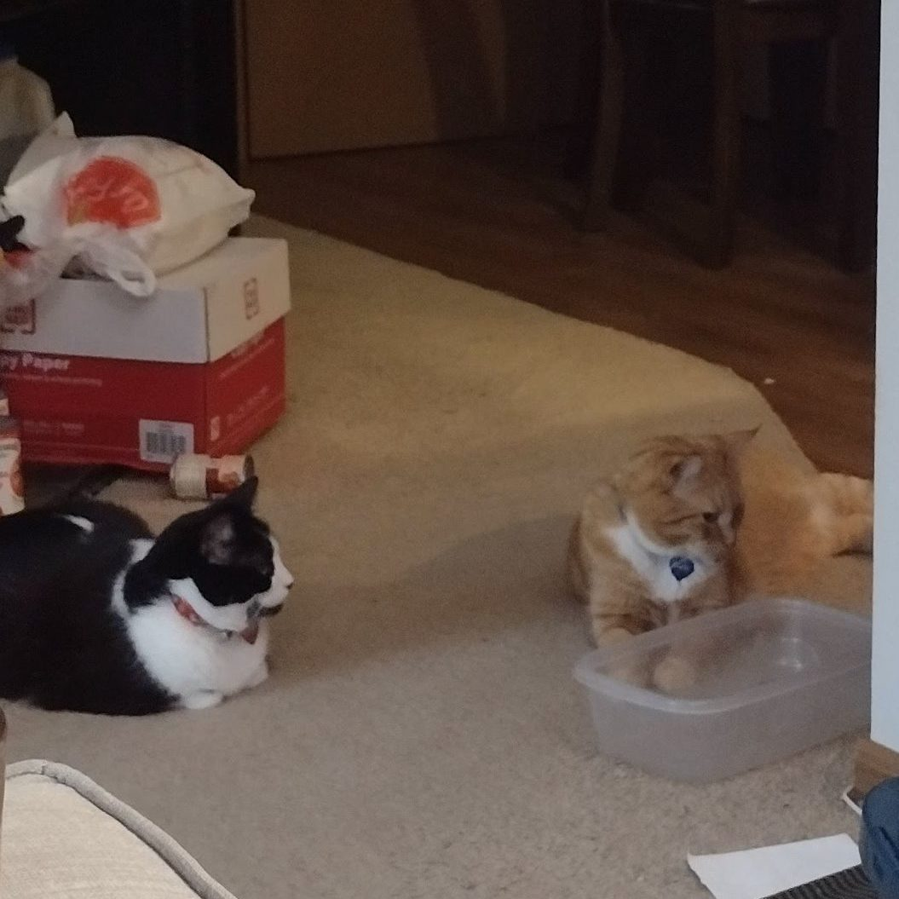
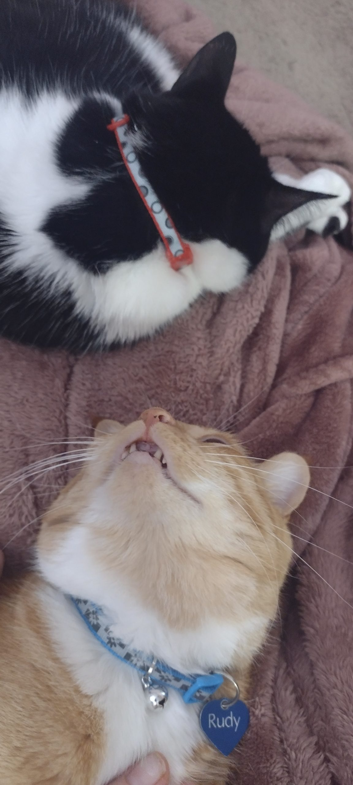

Our resident felines are not really friends with each other. We call them each others siblings, even though they're not from the same litter, they're entirely different ages, and look nothing alike.

Keladry Princess Panda Kochanski (generally known as Kochanski, or more often Chanski) is an Oreo potato, who arrived as a birthday present to my wife, several years before we met. She loves to eat multigrain cheerios from your cereal bowl, be the littlest spoon in all cuddle puddles, and chatter at birds that show up on our balcony. Her version of playtime involves a lot of screaming, mostly because she gets overstimulated very easily.

Rudy Not a Communist Sonnek (aka Rudolphus, but usually just Rudy) is an orange croissant who showed up in our lives just over a year ago. He is a big fan of most treats (except the churus every other cat seems to love), engages in a lot of happy floor wiggles when he's really feeling himself, and haunts our apartment like the ghost of a Victorian child with very sad little meows it's sometimes impossible to hear. Rudy's version of playtime involves dancing on various catnip-filled fruits and vegetables and then zooming out of the room like his tail is on fire.

For a long time, I thought they were never going to get along, since every play session involves Chanski screaming like Rudy is brutally murdering her and she's utterly helpless to stop him. Except that in the last couple months, they've started behaving a little less like magnets that repel each other, and engaging with each other a little bit more (plus there's that whole "easily overstimulated" thing where Chanski screams the second she's excited or upset about something). We're not to the point of happy grooming sessions, but I did come across them both sleeping comfortably on our bed a couple weeks ago, which I wouldn't ever have imagined happening.

Lately, they've started taking up the same post Moxie used to hold when dinner time is imminent. Of course, they only do this when they're waiting for their timed feeders to go off in the evenings, as though we've ever gone to bed without giving them food.

Rudy also used to seem very timid in Chanski's presence, but he's gotten a bit bolder about getting close to her, which could mean her screamy bluster is starting to lose its impact. Or, maybe he just likes her, and actually wants to be a bit closer to her.

I live in hope that they'll work things out and actually become friends, since I have yet to live in a multi-cat household where the cats just get along. Every pair of cats in my past has just decided to come to a very volatile truce, with built-in allowances that if someone gets to close, they get screamed at and swatted without impunity.

I truly believe Rudy's cautiously adoring fascination will overcome the fear in the end. He's acting less and less like a little baby man, and more like an aloof feline, so it can only be a matter of time, right?
