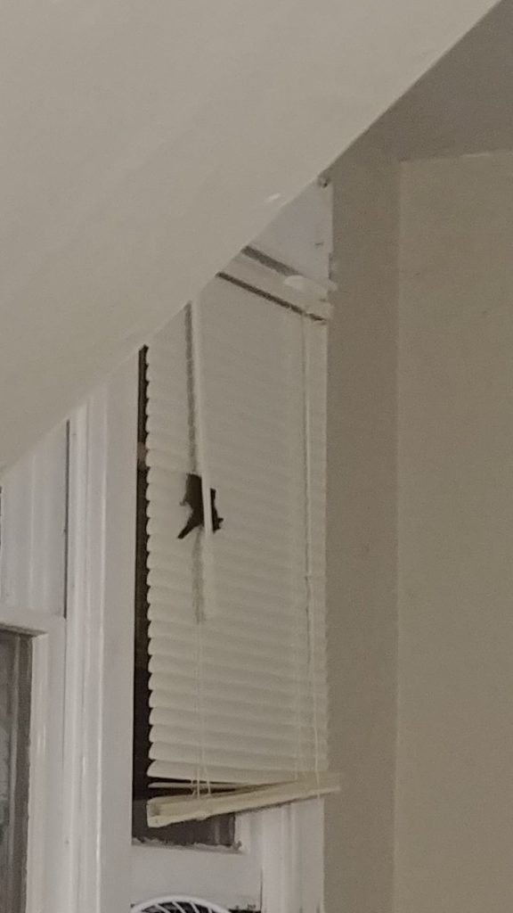
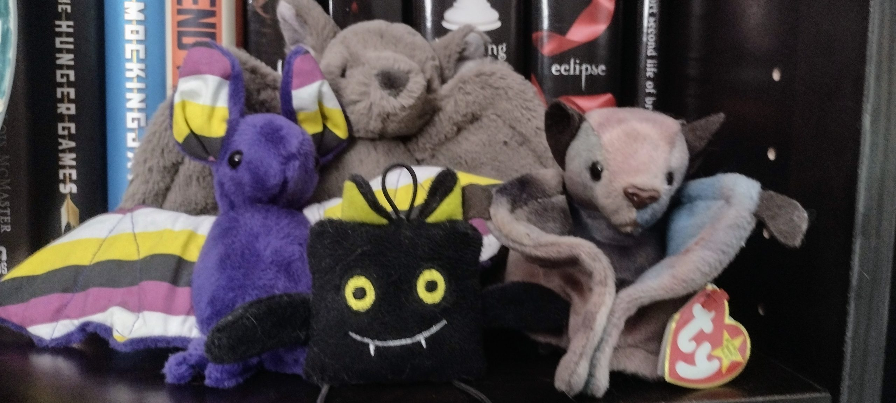

I'm really, really trying to figure out ways to post here more regularly, especially since this blog is just... a blog. It's not themed for a specific thing, other than my own personal life. With that in mind, one thing in my life is TikTok. When it really started becoming a household name in 2020, I held off (because no one can MAKE me try something) until it became very apparent that most of the content I saw in Instagram Reels originated elsewhere. So, I guess, when I've got nothing else Tuesday might be for TikTok.

Tying that into Introductory Week for Blaugust 2023, I figured I would mention a creator: [Kc Davis/domesticblisters](https://www.tiktok.com/@domesticblisters?lang=en). As someone exploring the realm of neurodiversity and how to live more effectively when it comes to the issues that come along with it, I've found her content to be very useful. Aside from that though... she recently had a [bat encounter](https://www.tiktok.com/@domesticblisters/video/7257721023800429867?is_from_webapp=1&sender_device=pc&web_id=7265049811043272234). Her reaction in her initial video of the incident is one I've experienced personally, on multiple occasions.

My personal outlook on bats is that I love and adore them, OUTSIDE. It's where they belong, I am happy for them to be there and nowhere else. I don't know what it is about bats being inside that makes me completely lose my sanity, but literally all I'm able to do is scream in their presence. There's no other response for me to have, it doesn't matter the time or place I encounter them. If they are flying inside of a building, I am screaming.

We had one that made its way to the second floor of my work's office building. I wasn't the only person screaming in that scenario, because you could hear it was flying around the open plan of the building like you were in a sports stadium and "The Wave" was coming around.

My cat Moxie brought one into my childhood bedroom, just as I was going to bed for the night. I'm still not sure how we survived that encounter without the bat becoming airborne after she took it down.

I moved into a _really_ shitty upstairs apartment in a house for a few years. It had a very poorly insulated closet with the ability to see daylight through the slats on the wall. On three separate occasions, bats woke me up in the middle of the night after getting trapped in my apartment. The last one was very outraged at its circumstances, and spent the entire time sounding the alarm until I was able to take it down and get it out of the apartment.

<figure>

<figcaption>

The last living bat I've personally encountered, it also screamed

</figcaption>

</figure>

I was already making plans to vacate those premises, but consistently having late summer turn into Batwatch™ was such an unpleasant experience. The first time, it took me three days to get them all out of the apartment, and there was literally a point where I practically burst into tears when I was talking with someone about how much I missed sleep.

Currently, I just have these bats in my life:

<figure>

<figcaption>

My little colony, no risk of rabies here

</figcaption>

</figure>

It's a good thing I never had any close physical interactions with the living ones, because I am _well_ aware of their ability to carry rabies. I never touched one with without using gloves or some sort of tool. I probably should have gotten a rabies series, just to be safe, but somehow I survived those encounters unscathed.

Oddly, my memories of bat encounters have been very present in my mind lately, and there's been a lot of paranoia on my part when it comes to unidentified squeaking or something I can see flying just on the periphery. There's something about returning to the time of year when I previously experienced something that brings it back to me, and bats are no exception. At least now I live somewhere they're less likely to invade. And I can have a mental breakdown and make my wife deal with them.
