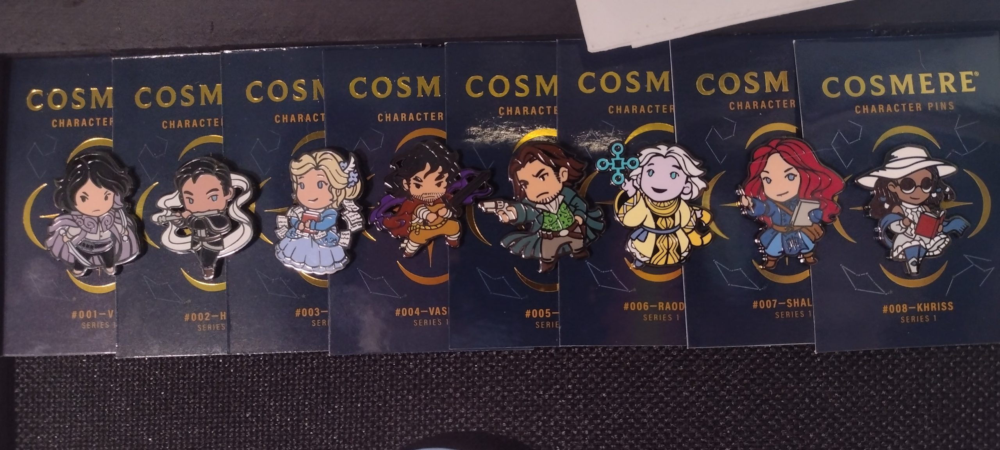
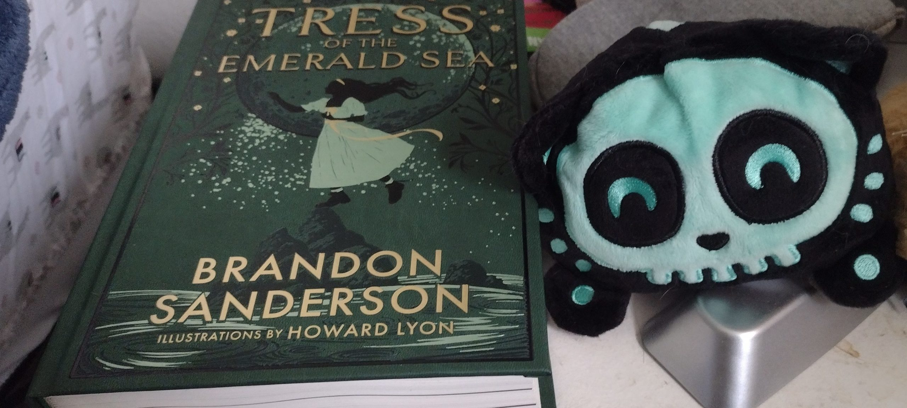

I've been a fan of fantasy fiction for pretty much my entire life. I re-read some books to tatters as a kid, because I just enjoyed the stories so much. As an adult, a friend introduced me to _Elantris_ by Brandon Sanderson, and that was my doorway into what I now know as the [Cosmere](https://www.brandonsanderson.com/what-is-the-cosmere/). After that, I devoured the first three [Mistborn](https://www.brandonsanderson.com/the-mistborn-saga-the-original-trilogy/) books and sort of lost myself to a lot of fantasy fiction, some higher and some lower.

I can't claim to be a devout fan of Brandon Sanderson, because I'm very behind in certain series and haven't even started others, but there's something about his work that I find fascinating. When I found out about his rules for his magic systems it became even more interesting to me for some reason. Something about the way he builds his worlds made them easier for me to inhabit. With his Stormlight Archive books, or the Mistborn books, I catch myself thinking about parts of the stories when I'm not reading them, but thinking about it as though it's real life. Literally, there have been moments when I've wished for tin or pewter, and I'm no mistborn!

March 2022, when the [Year of Sanderson](https://www.dragonsteelbooks.com/collections/the-year-of-sanderson) Kickstarter was announced, I was immediately tempted to sign up. First, it was just going to be for digital copies of the books, but then the print editions sounded like they were going to be so fun and interesting, and then I kept thinking about some of the themed swag boxes and after doing some math and making some choices about where I was going to spend my money for the next 12 months, I decided it was going to be worth it to sign up for the full year experience.

It started off a bit slow, because fulfillment of a project of this magnitude is quite an undertaking, especially when you have the most successful Kickstarter project of all time. Eventually, boxes started showing up, and I have yet to be disappointed with anything I've received. The foiled print editions of the books are gorgeous, the themed extras have been fun and surprising, and it's just been cool to have something show up as a surprise once a month.

I have an odd collection of enamel pins that has grown a lot over the last decade, and after regretfully losing some of them, I've become a bit protective about wearing them. I ended up getting a bulletin board, so my collection of Cosmere pins adorn the top, with my plan to fill it out quite neatly by the end of the year.

<figure>

<figcaption>

I've kept the cards from all of the pins, since I'm not familiar with every world in the Cosmere (yet).

</figcaption>

</figure>

Of course, the point of all of this was the four new books, and I'm ashamed to admit that until this week, I hadn't actually gotten around to reading any of the three I've received. I've become a bit utilitarian about my reading lately. For a long stretch, the only things I've read have been for the book club I meet with once a month. And my version of reading has been finding the book on Audible and listening to it at 1.5x speed, the day before we meet to talk about it. It's not a very satisfying experience if I'm being honest. Some of that comes down to the variety of genres we choose, but sometimes it's more about just rushing through the book and not bothering to take the time to connect to the story.

A few weeks ago, we stopped by our local library because I needed to fix an issue with my (under-used) library card, and we ended up wandering through the stacks and taking some books home with us. I managed to power through the graphic novel on cults in America (didn't love it) but then stopped short a quarter of the way into the queer thriller I had chosen. I don't like how picky I've gotten when it comes to certain genres, but I also know that sometimes I just have my limits about some things.

After dinner the other night, I was halfheartedly reading another chapter in the thriller while Ivory finished the dishes, and she decided she was game to read for the rest of the evening. Except, I wasn't going to read any more chapters of a thriller before bed (it seemed tantamount to pouring nightmare fuel directly into my brain). I ended up pulling my copy of [Tress of the Emerald Sea](https://www.dragonsteelbooks.com/products/tress-of-the-emerald-sea-premium-hardcover) off the shelf where it has languished since its arrival.

We settled in, and I'm now kicking myself for having this book in my possession and not bothering to look at it beyond the pretty cover and illustrations. I don't want to give anything away, but what a _strange_ world this story is set in! I'm only just starting Part Three, but so far, nothing has gone the way I anticipated, pretty much from the very beginning. I'm being surprised in pleasant ways though. There's also a lot of humor, which isn't ever something I seek out in my reading, yet I'm always pleased when it crosses my path.

<figure>

<figcaption>

_Tress_ and my Soonie Pup currently occupy my nightstand

</figcaption>

</figure>

Until my library books a couple weeks ago, I'm not sure when I had last read a physical copy of a book. I've spent a lot of time listening to books at work, doing chores, in the car, and I've amassed a collection of ebooks on a few different services. I've also had to grapple with the reality that physical books take up space, which is at a premium in our apartment. Books are also heavy, and when we pack them all up to move some day in the future, I'm not sure how happy I'll be hauling them out. Still, there was something nice about reading through a few chapters before bed without a screen shining in my face, or my brain focusing on a speed reading narrator while playing a game on my phone. Of course, reading right before bed isn't always the wisest option, since there have definitely been instances in the past where it's been next to impossible to put a book down; even when I'm looking at the other side of midnight with a full day of work ahead.

Still, there was something reassuring about sitting down with a tangible object in front of me. Also, having an idea of how far I've gotten was nice vs "how many times have I swiped or scrolled" being an indicator of where I am in the book.

I'm too much of a worshiper of technology, and too practical about our space to be a Luddite when it comes to books. But, I know I should make more of an effort to sit down and read through the copies I have in front of me (completely ignoring the backlog of books I've got in my Audible library and wishlist).

There are always books to be read, games to play, projects to finish, words to write. There's so much to do, it's just always about making the time to do it.
