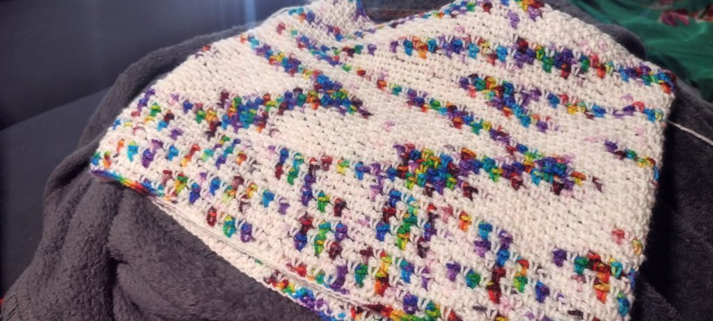

I'm pretty sure it would be impossible to be raised by my mother and not develop some sort of crafting hobby. I grew up wandering fabric stores and spending Saturday afternoons watching a bunch of people "birth" quilts they'd made in a day. At some point, I sewed and tied a small baby blanket for a friend's new sibling, spent most summers learning some sort of new beading project, and was addicted to my Klutz friendship bracelet book. Somehow, I didn't totally pick up crafting with yarn until I was 18.

There were a couple of aborted fiber craft attempts. My grandmother tried to get my sister and I to make some garter stitch dish cloths on some re-purposed double-pointed knitting needles. There was also a frustrating evening crowding around my mom on our loveseat trying to imitate her as she crocheted these delicate heart-shaped sachets. It took having _just_ enough downtime during my first semester of college for me to decide to pick up knitting. I managed a scarf and then somehow decided a whole afghan with cables was the way to go.

Knitting was easy for me. There were certainly challenging patterns and difficult stitches, but I didn't have a lot of the troublesome issues I see new knitters have: dropped stitches, extra stitches on the end, or not being able to tell where I was in a pattern. It was a great use of time, it was fun, and it got me hats, scarves, mittens... just warmth, which is something I'm very concerned with when it gets cold outside.

I think the one area where I did experience some challenges was tension. I knit a lot of patterns that didn't require much in the way of gauge swatches or very specific size requirements. Unfortunately, I had _very_ loose tension (I didn't hold my yarn tightly at all when I wrapped my stitches), which I didn't actually notice until a couple years in, when my sister and I decided to knit "spa sets" as Christmas presents and the bath mitt I had made was much bigger and floppier than hers. I knit pretty loose for probably the first 10 years of the hobby, and then I went down a rabbit hole where I got a bit obsessed with how Stephanie Pearl-McPhee tensions her yarn. It was like watching a magic trick, because somehow she wrapped stitches in her right hand, without having to let go of her needle. I knew about "picking" but this was almost like the "throwing" style I was used to, except you didn't have to lose hold of the needle.

This new style of holding the yarn changed a lot about how my patterns turned out. I had wanted it to make me a faster knitter, but I think it probably ended up making my stitches a bit neater along the way.

Twenty years after learning to knit, I've started to pickup up crochet, a thing I've done very sporadically in my life. If there's one thing I know about it, crochet is excellent when it comes to shaping things. With that in mind, I sat down to master the single crochet stitch and I made my wife's birthday present. That was sort of the gateway.

I've been a bit wary of busting into my stash of variegated yarn to crochet. Part of it was just not having the various crochet wraps and stitches, but I've also been a bit picky about "pretty" patterns. I managed to make a small asymmetrical scarf and then decided something more even should be next on the list. After an evening of scrolling through Ravelry's patterns, I came across the [Mutabilis](https://www.ravelry.com/patterns/library/mutabilis) pattern.

<figure>

<figcaption>

Apparently this can be a cowl, a hat, a scarf, a headband... any number of things!

</figcaption>

</figure>

The section at the bottom of the photo is how this started, and you can very clearly see where I decided I wanted to hold the crochet hook differently. It completely changed the way the yarn pooled. And then, it changed again when I picked it up a couple of days later and things were more humid and sticky, so the yarn wasn't moving through my fingers the same way. It's wild to me, that deciding to angle my hook a different way, and some sweat can have this much of an impact. I still have a decent-sized ball of yarn, which I got from The Yarnery a year ago, as part of their [One Yarn Collection](https://yarnery.com/collections/one-yarn-collection).

Part of me wants to find a similar yarn and then knit a project with a similar pattern, but then switch through my original throwing style, and picking, and the cottage-style knitting I do predominately and see just how differently the yarn will pool. Except that I'd really prefer consistency, which is probably why I've avoided doing much crochet with variegated yarns in the past, because I know I have a lot of work to do when it comes to the tension. Usually, this inconsistency would bother me, but I keep sort of picturing that first section as the brim or something, so I'm probably 95% okay with it (even though that's really how I wanted it to pool the entire time). If I had started the pattern with a different hook, I probably wouldn't have this drastic of a change, so even that can have an impact I guess.

This is always the hard part when it comes to learning a new skill, where I know what things are supposed to look like, but executing things to get the desired effect is still a bit of a challenge. I think I've learned enough to want to stick with it a bit longer, I guess we'll see how consistent things are in the future.
