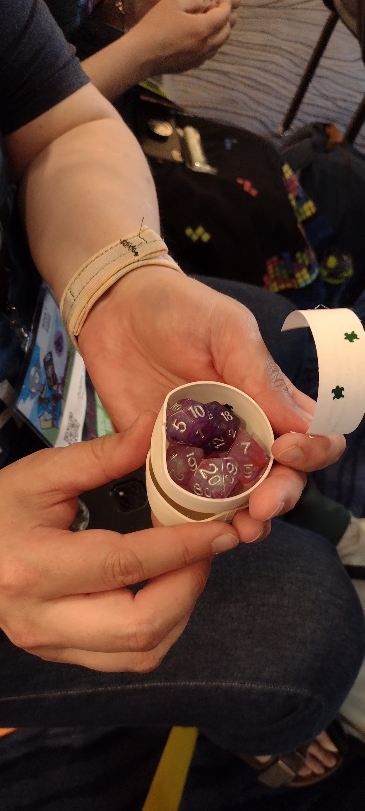

I can feel the malaise of "life after Blaugust" beginning to creep in. I noticed it first with how completely silent my Mastodon feed had become, and now I can feel it in my reluctance to open up a new post and click and clack some words on to a screen. Bluesky seems as bustling as ever, while Twitter (the place I haunt in silence, unless I have a Bluesky invite code to share) exists as a shell of the thing I used to love; and I don't know what to do with that. Some of this is down to that disconnect I still feel when it comes to so much of social media these days. I enjoy following along in the conversation, but participating in it has felt... off.

It reminds me a bit of the time that I had a conversation with a former employer, and as I was reflecting back on it later I was ticking off all of these boxes in my head, thinking about how I had successfully managed to offer her a compliment without it feeling forced or weird, and how we'd managed to have a somewhat lengthy conversation without any of the lulls I tend to find so disconcerting. I was congratulating myself on having successfully "peopled" without including any of the cringe-inducing mannerisms or comments I would usually berate myself over for days after.

Social media feels a bit like that to me now. Like, I know all of the rules to the game, I can follow other people playing the game. And then it's my turn and suddenly I'm stymied and over-analyzing every possible thing I could say and I just sit there until my time is up and think "maybe I'll try again tomorrow." Granted, playing the game of social media is actually just a dopamine slot machine I feed mental quarters into and hope I'll hit a jackpot at some point. I feel like I've gotten terrible about hitting the jackpot these last few years. And, then I get annoyed at myself because no one liked that thing I said, and then I'm annoyed for feeling annoyed.

I try my best to focus on just posting to post, to maintain the habit, because I know that siphoning these words off from my brain helps me function. I don't know what it is about curating my thoughts for public consumption that is so ridiculously helpful to me. I just haven't figured out how to turn these sorts of things into a conversation. That's always my issue in the end. Even in actual conversation, sometimes, it feels like I say words but they just result in a dead end. It's unproductive, or at least, it feels that way.

I can't help but to wonder if I did actually gamify my day-to-day activities when it came to people, how would it work out? Would it let off some of the pressure, because I was trying to follow some rules? Would my brain turn on the "it's just a silly game" track and force me to devalue the entire experience? I talked myself into buying dice at ConVergence this summer, and they've sat virtually untouched since then. For a while, I was thinking about trying to do solo RPGs or just trying to use them with some basic character building, just to get a feel for the mechanics. But, then Blaugust happened and all of my gaming habits were benched as I devoted my whole self to this place. Now, as all of the obvious subjects have been exhausted, my mind flits back to the math rocks sitting in their respective containers, all looking very pretty, but entirely unused.

<figure>

<figcaption>

I busted open this 3-D printed turtle egg with so much excitement

</figcaption>

</figure>

So, what's next? Will I go back to the obsessive D&D googling habit I was cultivating in July? Probably not. I think things are still cooking a little bit. It's like there's an idea sitting there, but it needs to germinate a little longer before I can figure out what to do with it. Hopefully ruminating on that here hasn't exposed it too soon, since I suffer from "startitis" and exacerbate it by revealing my plans too soon. It's like I out-run the dopamine or something.

Happy Tuesday everyone!
