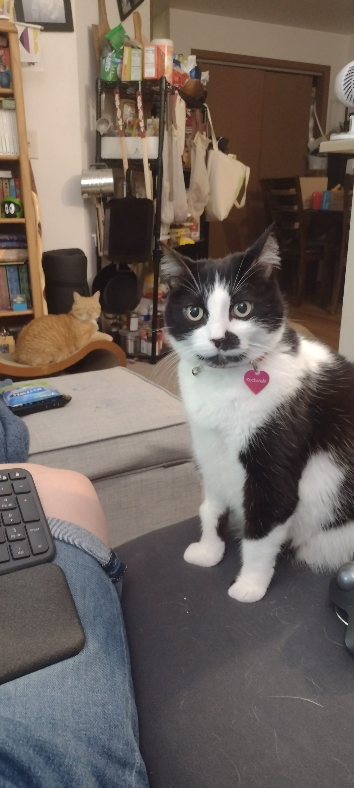

I don't want to think about what I was doing 22 years ago. It feels cliche to rehash it at this point, because my story is the same as everyone else's. It also feels wrong to think about it now. I think a lot about the obsession everyone had with the American Flag in the aftermath, and how that flag has been twisted and manipulated into propaganda of every kind now and mostly I feel disgusted. Part of that probably comes down to every civics-centered event I participated in between being 16 and 17 years old, and how much was hammered into my head about how you treat the flag. I watch what people do with it now and mostly I feel like an idiot for having so much reverence for an object everyone else has decided to manipulate rather than respect. So, that's how I'm feeling about things today.

* * *

I'm also just struggling a little bit in general today. Being out is the most exhausting experience at times, especially because I just don't know how to be out, for myself. I don't know how to interject the correct pronouns into a conversation. It feels like I'm just too afraid, too unsure to take the chance. Most of it comes down to practice, but when safe spaces are so difficult to come by, that leaves a lot of awkward places to advocate for my pronouns, for myself, and considering how averse I am to conflict it just becomes "easier" not to say anything. It's not actually easier, but it avoids the awkwardness of exposing all of my weak spots to people who may or may not understand, who might just choose unkindness rather than acceptance.

* * *

I'm resisting the urge to just pour everything into this blog like the journals of my adolescence. I'm hoping to start doing some morning pages again, so maybe there will be a bit more in the way of mental clarity for this place. Those pages are where it's completely acceptable to say anything, no matter how taboo it might be. Technically, I know I can say whatever I want here, but some of the things I want to say... well they're better off said directly to someone if they're ever to be said at all. Or, I could just take a big chance and spill everything that's bothering me out into the void and bank on it going unseen, remaining unaddressed until the end of time. It's one of those bad habits I've had for... basically my entire life. Rather than have the tough conversation, I just wait out the immediate need to talk about whatever has come up, and then I can pretend to move on because everything is fine. It's like I had the conversation, except I totally didn't, and it just builds up as this invisible wall between myself and others, until it's so tall and heavily reinforced that it's seems insurmountable. It's not healthy, but considering I don't know how to properly have anything resembling a difficult conversation or an argument, avoidance is a skill I rely on, way too much.

Happy Monday, everyone. Apparently it's going to be a long week.

<figure>

<figcaption>

Here's a photo of Chanski looking alarmed... possibly annoyed as a reward for getting through this post.

</figcaption>

</figure>
