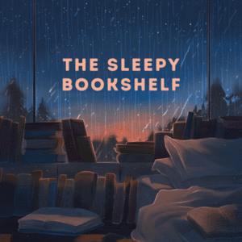

Having spent the summer with every manner of fan circulating air around our bedroom (and the rest of the apartment) it became next-to-impossible to hear any of the sleep podcasts we like, without blasting the audio in a way that wasn't remotely restful. The past two nights, things were finally quiet enough to try listening to them again and we both slept so soundly; it was such a relief.

Considering I've spent most of the summer sleeping with earbuds tuned to YouTube commentators gossiping about drama, it was past time I went back to something more geared towards sleep. The silly thing is, we both basically crash the second the podcast starts, because we had a pretty good habit going before we gave it up; there's something about a soothing voice telling a story that just makes the entry into sleep so much smoother, and in turn, it just makes it easier to _stay_ asleep.

* * *

I've used a variety of sleep podcasts over the years. There was [Sleep With Me](http://www.sleepwithmepodcast.com/), which had such an extensive back catalog, when I first discovered it, I would just queue up 8 hours worth of episodes and let it play all night (I eventually found the "creaky dulcet tones" less restful and a little too quirky to use it to actually fall asleep, it's only good when I'm straight-up exhausted).

[Get Sleepy](https://getsleepy.com/), was my go-to for a _long_ time, until they got syndicated advertising that would play just after the introduction. I have nothing against ads in a podcast, but it's one thing for it to be an ad read from the host and a completely different thing when it's a State Farm ad that's set to music and entirely different from the tone of the rest of the show.

The makers of _Get Sleepy_ also came up with [The Sleepy Bookshelf](https://sleepybookshelf.com/), which just takes stories in the public domain and breaks them up into pieces and reads some of the story a couple of nights a week. The only times that one hasn't been good for sleep was the torture of _Journey to the Center of the Earth_ (I found it too claustrophobic and a lot of the story was just too creepy), the Beatrix Potter Stories (I was obsessed with being able to hear _The Tale of Squirrel Nutkin_ in its entirety), and the end of _Anne of Green Gables_ (it actually forced us to turn the lights on so I could find a tissue I was crying so much).

Our tried and true sleepy standby now is [Nothing Much Happens](https://www.iheart.com/podcast/263-nothing-much-happens-bedti-29945275/). I had actually forgotten that was an iHeart podcast, because it doesn't do ads the same way so many of their shows do (annoyingly, with the same 3 ads every 20 minutes). If you're looking for something to help you sleep, I can't recommend it enough. We rarely make it into the story portion of the podcast these days. I was surprised that even when we picked it back up again, it was very easy to fall into the routine of taking a couple of deep breaths, mentally sending some relaxation through my extremities, and basically zonking out for the night.

* * *

As I look back through this post, I keep seeing I have something against advertisements, except that's not actually the case. If you ever get to listen to my "the MLB doesn't want me to watch or listen to their games anymore" rant, you'll hear how I actually enjoyed all of the local Boston ads when I would listen to the Red Sox streams; it set the scene for me basically, and I wasn't ever annoyed to hear those. I only gave up on streaming the radio games when they started playing generic ads over the local ones (and coming back to the game in the middle of at-bats. With the ad reads that used to start off _Get Sleepy_, when they were in the voice of the creator, I really didn't have a problem with them. I just don't like listening to ads that are aggressive in their need to sell me something, especially as I'm trying to fall asleep. I also gave up on any iHeart podcasts when they played the same three ads every 20 minutes, regardless of the length of an episode. I'm sure the goal here is to make the ads so annoying to compel listeners to pay for the premium service, but persistent demand avoidance means if I "have" to do something I'm much less inclined to do it.

I'm a little embarrassed at my persnickety attitude when it comes to something so random. "How strange to be so opinionated about when and where ads should play." But, I guess that's where things are on a Tuesday afternoon.
