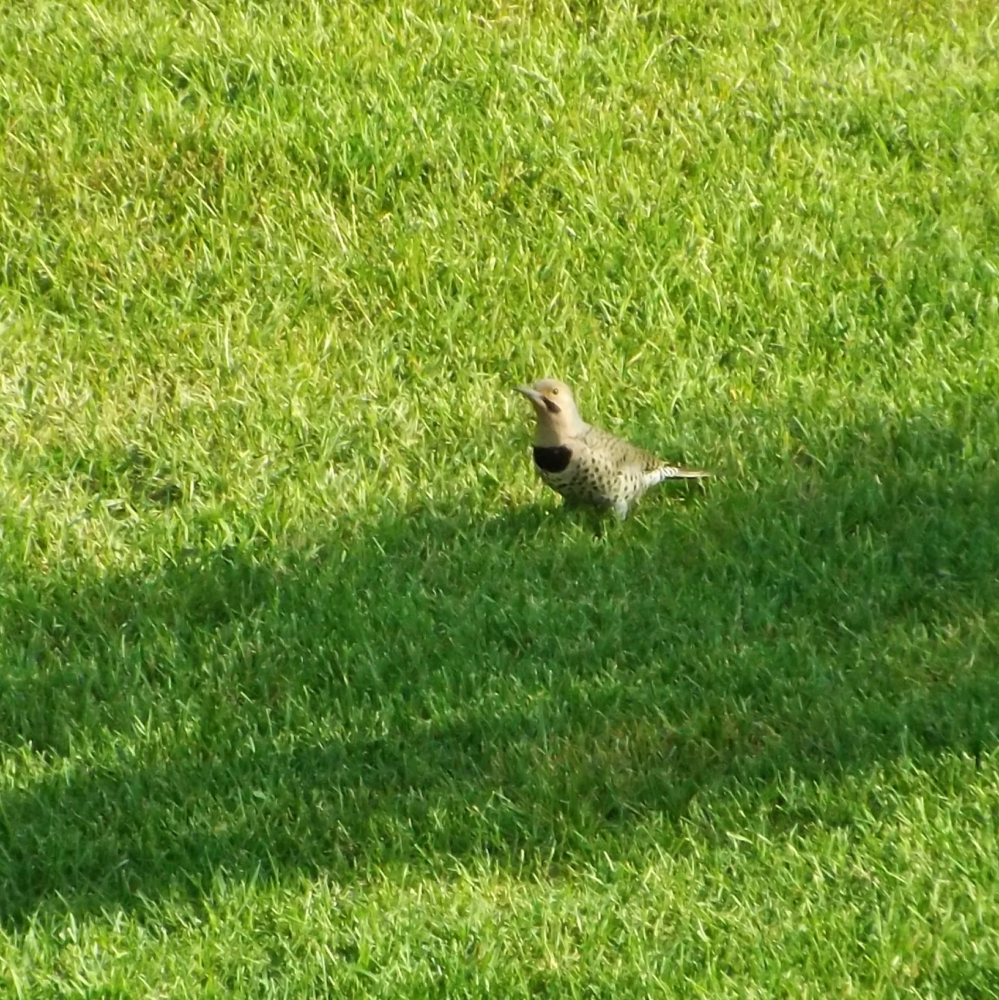

I saw someone on Bluesky comparing that scene in so many disaster films, where hundreds of people have survived an event and are then rewarded with the relief of being reunited with their family and friends to the feeling they get seeing a familiar face showing up on Bluesky. I know the feeling all too well.

There are also so many people I'm missing. Some of them don't have accounts and remain on Twitter, others created placeholders and have yet to interact, and others seem to have vanished into the ether. Bluesky seems to offer new options pretty much every other week these days (actually working hashtags might be on the horizon), but I have a feeling it's very much going to be what Twitter used to be. That thing people heard of but rarely used or didn't understand. Truth be told, I still sort of stumble over how to talk about it when I mention something I saw to my wife or a friend. I have yet to use "skeet" (it feels almost as awkward as "toot" did when discussing Mastodon), and I'm pretty sure it's not well known enough for casual users of technology to know what it is.

I don't want it to be Twitter, with the algorithm and the outrage machine, but I do want everyone I knew under one umbrella so I can stop trekking back to the hellsite once a week to see what I've missed. I sort of treat it like an experiment I can only observe these days. I don't like or retweet anything, the only thing I will post is an update if I have an invite code to Bluesky (there's actually one available as I write this, if someone out there is interested). Sometimes, I have to remind myself not to engage, but the reminders are less necessary than they were a month ago.

At some point, maybe I will stop going back there, but Bluesky doesn't have enough of a finger on the pulse of the news cycle for me to completely abandon Twitter, even if it's only to pop back and scroll through the trending topics as a refresher on whatever is going on politically or culturally.

* * *

In other news, check out one of the Northern Flickers that have been hanging out on the lawn outside of our apartment. They're a little chatty and very skittish, so I had to lurk on the balcony with a long lens camera just to get this mediocre photo. They've been interesting to watch, since the 6 or more of this particular guttering pace around the grass pecking at it with determination at times.

