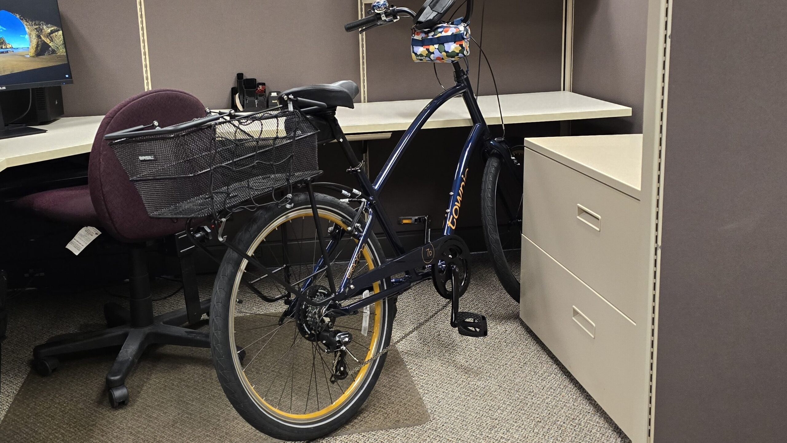
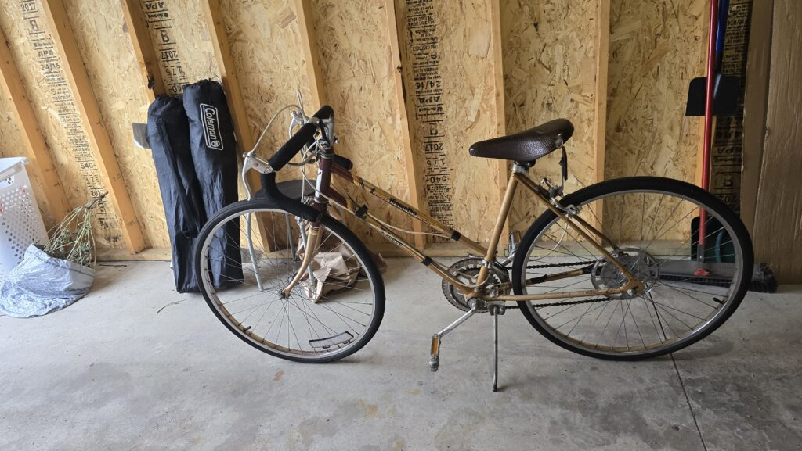

I thought about posting yesterday, and then got sucked into nonsense on top of exhaustion, and completely forgot to write anything, so this morning there will be a recap of yesterday, and at some later time, I guess I'll be putting up 2 posts in 1 day?

At some point, I need to take actual pictures of my bike, maybe even with me on it. For now, this is what we've got.

I managed to ride my bike to and from work yesterday without incident. I only made one bad move in my travels, and those always seem to happen when other cyclists are around. Thankfully, it didn't lead to anything harmful. Mostly, it just reinforces how much I still have to learn when it comes to actually traveling by bike and not just tooling around on smooth paths with no cars beside me.

Other lessons learned: getting on a step-over style bike (aka a "boy" bike), with a basket containing a computer bag is a lot harder than just getting on the bike, especially while wearing jeans. I'm still just very new to all of this stuff; the getting on the bike, moving forward after coming to a stop, getting OFF the bike; basically me using this bike is still a big old awkward thing. But, I really do enjoy riding it.

I especially enjoy riding it compared with the one I chose to use as a reintroduction to riding bikes.

If I put my new bike next to this old one, I feel like the old one would look spindly, frail, and very light, but when we experimented with hanging this one up, we realized it's so much heavier than either of our new bikes, and between that weight and the drop bar handles, we decided this one just wasn't for us. So, now we have to figure out how to get rid of re-home it. I'm not sure who would want a 1970's department store bike, but hopefully someone else would like a free experience on re-learning to ride a bike before moving on to something better. I'm just hoping it won't still be in our garage come fall, since space is always at a premium when it comes to apartment living, even with a garage.

It's much easier to get out and ride now that my wife has a working bike of her own. I had to laugh last night, because she wanted to do a few loops around our apartment complex, and then after hitting every section of the parking lot I heard "Okay, this is boring, let's go to the trail." It had looked like it was wet and maybe wouldn't be fun to ride, but then we took off for the park, and it was just a nice night to be out on a ride. I think today will also be a good riding day, since it's not going to be very warm, but the sun looks like it will be out most of the day.

I really thought we might be in for a cool and unpleasant summer, but it's been pretty enjoyable, even if it's rained a lot at times, and been momentarily humid. We still have some time before the season officially changes, but it's certainly been a nice summer, especially on a bike.
