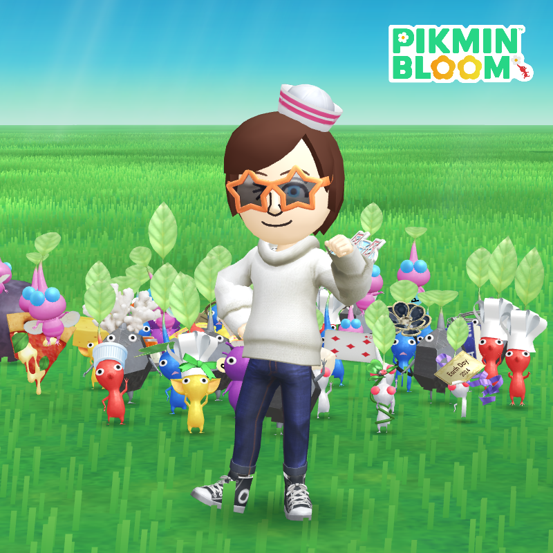
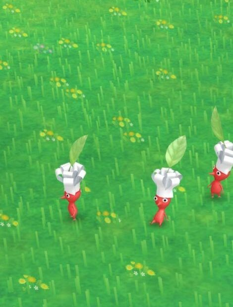
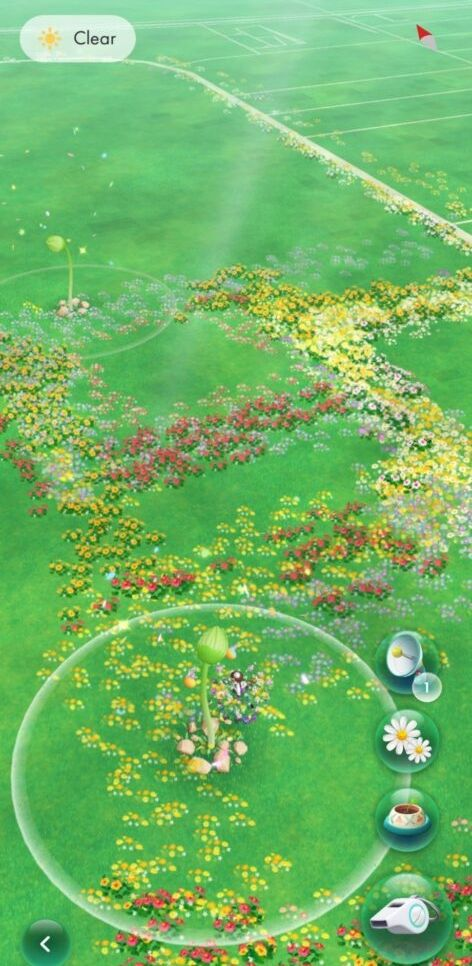

I turned 39 earlier this year.

When my wife hit that point a year ago, she made a comment about wanting to have walked a certain amount of distance before she hit 40. I thought it was a good idea at the time, but didn't really think of it as any sort of necessary thing for myself in that time frame. I would be supportive (it would be good for the both of us if I participated) but I certainly wasn't going to go overboard when 40 got closer on _my_ horizon.

Then suddenly that 9 ticked over on my own timeline and it was there... looming over me; the need to "do something" before 40 hit.

I'd like to think I've found ways to meet that need since it first arose, but it's taken some trial and error to get here.

We started being more diligent about morning walks when the temperature was consistently over 40 degrees in the morning. I don't think a week has gone by where we haven't walked, especially since this summer has been so pleasant. But, walking can only be so engaging.

We started tracking steps, walked to the grocery store a couple of times, I tried to get back into doing RingFit Adventure (with middling success). Just a mishmash of activities, basically.

Somewhere in the midst of that, I found [Pikmin Bloom](https://pikminbloom.com/en/).

At first, I didn't bother too much with it. My phone at the time didn't much enjoy me using such a resource intensive game, but I was at least familiar with Pikmin in a way I never have been with Pokemon.

I was haphazard in my first month, not really caring about the month's event or trying to make anything happen. Then, at some point, something clicked, and I was all in.

It's been especially helpful having a couple of large flowers basically to myself in our apartment complex, as well as being in range of a few other locations that have mushrooms (the thing you battle to get more nectar, to then plant more flowers, and get _more_ nectar).

Then I got into collecting the decor, and that's probably when Ivory started to hear more about me walking around and collecting gifts on expeditions.

It's taken up a good chunk of my time this summer, but there are only a handful of players in my area. Things picked up a bit during the 2 weeks that Unicon was being hosted, but otherwise I only regularly see one other player in the area I've come to think of as my own.

I know I'm pretty isolated here, but it really comes into focus visiting a larger city. When we were at the Hyatt in Minneapolis, the first week of July, we were basically on an uninterrupted carpet of flowers. Here, you can tell exactly where I have walked, every single day.

August's theme is Ice Cream, so my specialized squad of Pikmin are adorned with scoops and swirls of ice cream and little extra touches. I'm pretty sure the flying pink ones shiver with a brain freeze since the massive scoop of ice cream sits right on top of their heads. It's cute watching them bop around on my screen with pretty flowers bobbing on their heads.

I'm glad I found this game, since it's certainly helped me get out of the house just a little bit more, even when I haven't felt like it. I managed 10,000 steps yesterday thanks to trying to walk around our local park blooming flowers. It's on odd, meandering sort of thing, but it made taking the walk a little easier, since I seem to need a more immediate intention behind these sorts of things.

I think this is the same reason I get more satisfaction out of riding my bike to do errands than just taking a short trip around the neighborhood for the heck of it. I'm assuming some of this comes down to needing the dopamine reward at the end, because once the novelty of the experience wears off it's just not the same.

Pikmin Bloom is also slightly responsible for my new bike adventures, since it's very easy to plant flowers from a bike. I'm enjoying that aspect, a lot.

I'm now 2 posts behind for this month. I'm hoping to do a couple of end-of-day recaps, depending on what we end up doing on our week off. We'll see, I guess.
